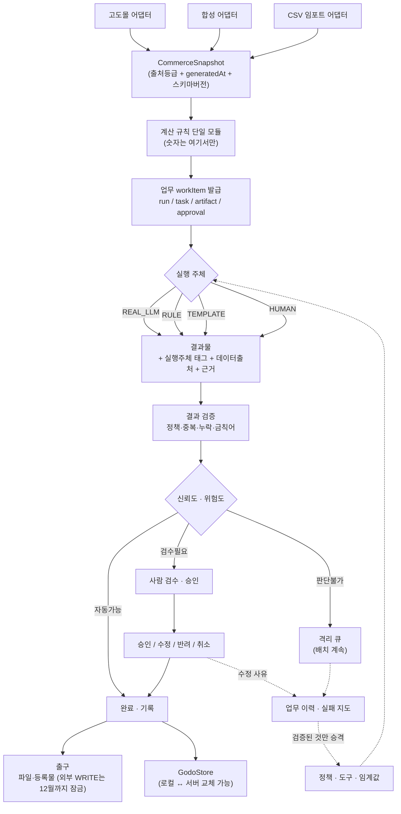

# GODO AI OS — 기준선 감사 문서 (DRAFT)

> **상태: DRAFT — 최종 확정본이 아니다.**
> 이 문서는 **기준선 시점의 사실 기록**이며 **구현 지시서가 아니다.**
> 여기의 "수정 범위"는 조사 결과에서 도출한 후보일 뿐, 승인된 작업 지시가 아니다.
> 각 단계는 착수 전 별도 설계·승인을 거친다. `PROJECT_STATE.md`는 아직 갱신하지 않는다.

- **기준선 커밋**: `2d68505` / 브랜치 `feature/baked-grid-generalize` (api/ 는 main과 동일 — `git diff main...HEAD -- api/` 무변경)
- **해결 이력**: `SEC-03` → **`91cc69d`** (1차 차단) + **후속 커밋**(fail-closed 보정: IP 리터럴 차단 대역을 allowlist보다 우선 적용). 아래 §0의 취약 코드 인용은 **수정 전 상태**다.
- **감사일**: 2026-07-21
- **감사 방식**: 10개 영역, 병렬 read-only 감사 14회. **코드 변경 0건.**
- **문서 성격**: 기준선 전용. `PROJECT_STATE.md`는 단계별 수정 완료 시점에 별도 갱신한다.
- **원칙**: 과거 보고서가 아니라 현재 코드가 근거다. 추정과 실측을 분리한다. 검증 못 한 것은 UNKNOWN으로 남긴다.

---

## 0. 긴급 항목 (SEC-03) — **해결됨 (`91cc69d`)**

> 아래는 발견 시점(수정 전) 기록이다. 조치 결과는 이 절 끝의 "조치 완료" 항목 참조.

### 사실 확인

| 확인 항목 | 결과 |
|---|---|
| `api/detail/[action].ts` 가 main에 포함되는가 | **예** (`git ls-tree main -- api/detail`) |
| 프로덕션에 배포되어 응답하는가 | **예** — `GET https://godo-psi.vercel.app/api/detail/image-proxy` → **HTTP 400** (핸들러 실행됨, 라우트 존재 확정) |
| 인증·rate limit | **없음** (`api/detail/[action].ts` 전체에 인증 코드 0) |

### 실제 위험 (과장 없이)

`api/_shared/detailImageFetch.ts` 의 SSRF 가드(`isBlockedHost:9-23`)가 차단하는 것:
`localhost` / `*.local` / `*.internal` / `::1` / `0.0.0.0` / `127.x` / `10.x` / `0.x` / `169.254.x` / `192.168.x` / `172.16~31.x`

**차단하지 못하는 것 (전부 코드로 확인):**

| 우회 벡터 | 근거 |
|---|---|
| **리다이렉트** — 공개 호스트가 302로 내부 주소를 가리키면 통과 | `:45` `redirect: 'follow'` — 초기 URL만 검사 |
| **10진수 IP** `http://2130706433/` (=127.0.0.1) | `:13` 정규식 `^(\d{1,3})\.(\d{1,3})...` 에 미매칭 |
| **DNS rebinding** `127.0.0.1.nip.io` 류 | 호스트 문자열만 보고 해석 결과 IP를 안 봄 |
| **IPv6 사설** `fc00::/7`, `fe80::` | `::1` 만 차단 |
| **CGNAT** `100.64.0.0/10` | 미차단 |

**완화 요인 (정직하게 기재):** `:50` 이 `content-type: image/*` 를 요구하므로 클라우드 메타데이터(JSON) 본문 유출은 어렵다.

**그래서 실제 심각도 = 높음 (치명 아님).** 확정 피해 2가지:
1. **오픈 프록시 남용** — 누구나 우리 Vercel 함수로 임의 URL을 최대 15MB씩 무제한 반복 다운로드시킬 수 있다. 대역폭·함수시간 과금이 그대로 우리 것이다.
2. **내부 스캔 오라클** — 응답코드(400/422/502)와 타임아웃 차이로 내부 호스트·포트 생존 여부를 알아낼 수 있다.

### 긴급 차단안 (택1, 전부 소규모)

| 안 | 내용 | 범위 | 부작용 |
|---|---|---|---|
| **A (권장)** | 허용 호스트 allowlist — 고도몰/바나나몰 CDN 도메인만 통과 | `detailImageFetch.ts` 에 상수 1개 + 검사 1줄 | 다른 몰 이미지 변환 시 도메인 추가 필요 |
| B | `redirect: 'manual'` + Location 재검사 + 호스트 정규화(10진수/IPv6/DNS 해석) | 같은 파일 ~30줄 | allowlist보다 구멍이 남음 |
| C | 라우트 전체를 비활성 후 dev 전용 전환 | `api/detail/[action].ts` | **프로덕션 변환기가 즉시 동작 불가** (CORS taint 회피 경로가 사라짐) |

→ **A + B 병행**을 권고. C는 변환기 시연이 막히므로 비권장.

### 조치 완료 — 커밋 `91cc69d`

A+B만으로는 불충분하다는 판단에 따라 6층으로 처리했다.

| 조치 | 내용 |
|---|---|
| 호스트 allowlist | 정확 일치만. 기본값 `cdn-banana.bizhost.kr` — **실측 근거**: `test/*.xlsx` 14개에서 추출한 이미지 URL 101건이 전부 이 호스트(`www.bananamall.co.kr` 12건은 상품 페이지 링크로 이미지 아님). 확장은 `DETAIL_IMAGE_ALLOWED_HOSTS` 환경변수(와일드카드·점 시작 항목 거부) |
| 리다이렉트 | `redirect:'manual'`. 상대 Location 포함 매 홉 전 검사 재실행, 최대 3홉 |
| DNS IP 검사 | 사설·loopback·link-local·CGNAT(100.64/10)·IPv4-mapped·IPv6 ULA/link-local/멀티캐스트/NAT64/문서용 차단 |
| MIME | jpeg/pjpeg/png/webp/gif만 허용, **SVG 차단** |
| 용량 | Content-Length 사전검사 + 스트리밍 중 상한(전량 수신 후 검사 폐지) |
| 남용 | 인스턴스 로컬 캐시(TTL 5분, 32MB) + rate limit(IP당 분당 120) |
| 포트 | 80/443만(비표준 포트 차단) |

**남은 한계 (완료로 표시하지 않는다)**
- **DNS 재바인딩은 완전 해소되지 않았다.** 조회 시점과 연결 시점 사이 TOCTOU가 남는다. 실질 방어는 정확 호스트 allowlist다(공격자가 allowlist된 호스트의 DNS를 통제해야 성립). 완전 차단은 "해석된 IP로 직접 연결 + Host 헤더 고정"이 필요 — **장기 보완**.
- **rate limit·캐시는 서버리스 인스턴스 로컬**이라 전역 보장이 아니다 — 서버 스토어 도입 시 보완.
- **관리자 인증 없음** — 장기 보완(RC-2/RC-4 이후).

**검증**: `scripts/smoke-detail-image-fetch-guard-v0.mjs` **62 pass / 0 fail** (로컬 가짜 서버로 리다이렉트·MIME·용량·캐시 재현. 실제 내부 주소는 검사하지 않음). `tsc -b` 0에러, `npm run build` 성공, 실제 CDN 이미지 통과(24,371 B) + 비허용 도메인 400 거부 확인. 신규 lint 오류 0.

---

## 1. 근본 원인 6개 — 증상이 아니라 원인 기준 대장

오늘 나온 40여 개 발견을 증상별로 나열하지 않고, **원인 6개 아래로 통합**했다. 같은 원인에서 파생된 증상은 개별 수정하지 않는다.

---

### RC-1. 하나의 데이터 원본과 계산 규칙이 없다

| 항목 | 내용 |
|---|---|
| **근거** | 원본: `App.tsx:444`→`validationScenarios.ts:15`(정적 mock 딥카피) · `godomallResource.ts:329`(real+synthetic 단일배열) · `:311`(mock이 `dataKind:'real'` 오태깅) · `fetchRevenue` 독립 호출 3곳(`OfficeView.tsx:74`, `CalendarPanel.tsx:80`, `DepartmentWorkspacePanel.tsx:230`)<br>정의: `revenueMetricContract.ts:46` canonical 존재하나 `planner.ts:156`·`scopeInsight.ts:111`·`crosstab.ts:178`·`marketingAnalysisExecutor.ts` 가 각자 복제, `analyticsQueryEngine.ts:382` 는 판정 자체 부재 |
| **파생 증상** | 매출 7정의 · 미처리문의 6정의 · 재고위험 4정의 · 재구매 3정의 · 유효주문 판정 5벌+무판정 1 · 부서별 다른 숫자 5경로 |
| **확정 버그(원문 재확인 완료)** | ① `planner.ts:525` / `scopeInsight.ts:321,324` — `for (const l of o.lines)` 안에서 `orderCount += 1` → **상품·카테고리 축 주문수 = 라인 수, 객단가 = 라인당 매출**. 대조군 정상: `marketingAnalysisFacts.ts:294`, `marketingAnalysisExecutor.ts:62,72`, `scopeInsight.ts:274,306`(주문 단위)<br>② `bool()` **3변종**: `revenueMetricContract.ts:38`/`planner:153`/`scopeInsight:107`/`facts:227` = `'y'`만 / `marketingAnalysisExecutor.ts:49` = `'Y'`·`1` 포함 / `departmentDataService.ts:68` = `'1'`·`'true'` 포함, `'Y'` 없음<br>③ `analyticsQueryEngine.ts:383-384` — reviews/inquiries 기간 미필터<br>④ `commerceDataQueryEngine.ts:394` — `share` 연산이 `plan.metric` 무시하고 항상 매출 비중<br>⑤ `departmentDataSourceOfTruth.ts:111,113,141` — synthetic 전용 필드·임계 20 하드코딩·`generatedAtMs: 0` |
| **사용자 영향** | 같은 질문에 화면·부서마다 다른 숫자. 실데이터 전환 시 무성 오작동 |
| **심각도** | 치명 |
| **선행조건** | CommerceSnapshot 데이터 계약 확정 |
| **수정 범위** | 계산 규칙 단일 모듈 강제 + 복제본 제거(서비스 6개) + 어댑터 3갈래(고도몰/합성/CSV) |
| **실패 재현법** | 동일 주문 집합에 대해 6엔진의 `orderCount`·`aov`·`revenue`를 나란히 계산해 불일치를 assert (순수 함수 직접 호출, 문자열 검사 금지) |
| **완료조건** | 지표 계산 진입점이 1개. 6엔진 결과가 동일 입력에 대해 완전 일치. 복제된 `bool`/`isValidOrder` 0건 |

---

### RC-2. 업무·실행·결과물·승인을 잇는 번호 체계가 없다

| 항목 | 내용 |
|---|---|
| **근거** | `App.tsx:565` `taskId: \`task-${agentId}-${Date.now()}\`` (조작 생성) vs `:546` `id: \`runtime-task-${idx}-${Date.now()}\`` → `App.tsx:700` 매칭 **항상 실패**<br>`managerOrchestrator.ts:5-9` `proposedTasks`에 id·artifact 없음, `:40` agentId 네임스페이스 불일치(`'stock'` vs 런타임 `inventory_monitor`)<br>`agentTaskRunner.ts:81` pending에 `refId` 누락 → `activityLedger.ts:91-96` 이 `noRef`로 분리해 **dedup 대상 제외** → pending 영구 누적<br>`handoffEngine.ts:19-25` 부서 **첫** 결과만 `find` → 재고(index1)·리뷰(index3)·기획서(index5) 전부 누락, `planIndex` 항상 -1<br>`nativeAgentRuntime.ts:39,119` 예외 없으면 completed, run status 하드코딩. `types.ts:123` 상태 4값에 부분실패 없음 |
| **파생 증상** | 승인해도 업무 미반영 · 재고 경보 전달 불가 · pending 카운트 단조증가 · 실패가 표현 불가 · 업무 보드에 항상 1건만(시나리오 무관) |
| **추가 근거(양호)** | 이미 있는 것: `AgentArtifact.id`/`runId`(`types.ts:89-91`)를 `proposedApprovalItems`가 **객체째 보유**(`managerOrchestrator.ts:25`) — 결과물 연결은 데이터가 이미 있음. `DepartmentId`↔`DeptTeamId` 5중 4일치, 위험도 어휘 4중 3 문자일치, `TeamMessageActor`는 원장이 이미 재사용 |
| **심각도** | 치명 |
| **선행조건** | run–task–artifact–approval 상태 계약 확정 (모델 통합이 아니라 **외피 + 번호**) |
| **수정 범위** | 승인 결정을 순수 함수로 분리(`applyApprovalDecision`) + correlation 4종 전달 + 승인 후 삭제 금지(CS 큐 방식) |
| **실패 재현법** | 순수 함수 직접 호출로 승인→업무 상태 전이 assert. handoff는 재고 시나리오에서 경보 전달 assert. pending은 승인/반려/**취소** 3경로 각각 1건으로 닫히는지 assert |
| **완료조건** | 한 업무가 생성→실행→결과물→승인→기록까지 단일 ID로 추적 가능. 취소 포함 3경로 모두 닫힘 |

---

### RC-3. 화면은 있으나 실제 산출물·실행 출구가 없다

| 항목 | 내용 |
|---|---|
| **근거** | 변환기: `DetailPageBuilder.tsx:109` `toJpeg(element)` → `:127` `link.download` — **프리뷰 DOM 통째 캡처한 평면 JPG**. HTML·마크업·상품등록 데이터 0. `flowBlocks` 구조 전량 소실<br>CS: `csApprovalQueueBridge.ts:26` `writeStatus:'not_connected'` 리터럴 타입, 서버 WRITE 라우트 미생성<br>보고: `ReportModal` 헤더는 실제 출처 배지, 본문은 하드코딩 시나리오 산출물<br>승인 상세: `OfficeView.tsx:50-65` 구조분해에서 `onSelectTask`/`onSelectApproval` **누락** → 모달 도달 불가<br>`ChatConsole.tsx:37,383` `commerceData` 분기가 `MainLayout.tsx:349` 미전달로 **영원히 false**<br>`EnginePanel` 상단 Cloud/Local 탭 = `setTimeout` 가짜 성공 토스트<br>거짓 신호: `App.tsx:735`(네트워크 0인데 "커밋 완료") · `controlChatService.ts:665-704`(호출 없이 부서 AI 의견) · `App.tsx:575-579`(latency/piiRemoved 상수, 실제 `fallbackUsed`를 false로 덮어씀) · `csDraftGenerator.ts:43,117`(하드코딩 답변에 "무료배송 쿠폰 지급" 보상 약속 포함) |
| **파생 증상** | 5개 흐름 중 완주 가능한 것 1개(변환기), 그 산출물도 등록물 아님 |
| **심각도** | 치명 |
| **선행조건** | **고도몰 최종 등록 산출물 계약**(§3) 확정 |
| **수정 범위** | 출구 계약 → 출력기 구현. 거짓 신호는 문구/삭제 수준 |
| **완료조건** | 상품 1건이 "엑셀 선택 → 고도몰에 넣을 수 있는 묶음"까지 사람 손 없이 도달. 화면의 모든 성공 표시가 실제 결과와 일치 |

---

### RC-4. 저장이 화면마다 흩어져 있고 버전·복구·동시사용 구조가 없다

| 항목 | 내용 |
|---|---|
| **근거** | localStorage 92콜 / 키 42개 / **IndexedDB 0건**. 컴포넌트 직접 51콜(App.tsx 40) = 55%<br>서버이전 필수 7키 중 5키는 소유 서비스 有(쉬움), `godo.data.activeSnapshot`·`importHistory`는 소유자 없음(어려움)<br>무제한 성장 키 6개, 대용량 3개(`activeSnapshot`, `importHistory`, `builder_temp_save`)<br>`builder_temp_save`: 기본형 1상품 ≈4.1MB, 단순형2 20파트 ≈8.2MB, 통이미지 1장 ≈9MB (실측 앵커 기반 산정) → **1상품도 한도 초과 가능**<br>스키마 버전은 `csLocalStatePersistence.ts:14` **1곳뿐**, 마이그레이션 0건, `as T` 단언이 은폐<br>다중탭: `App.tsx:222-313` 19개 useEffect가 마운트만 해도 전량 덮어씀 → lost update. storage 구독은 4개 스토어만<br>저장 실패 무음 삼킴 20+ 지점 |
| **파생 증상** | 배치 저장 불가 · 팀장 다중 사용 시 즉시 유실 · 타입 변경 배포 시 런타임 undefined · 조용한 데이터 손실 |
| **심각도** | 높음 (다중사용자 전환 시 치명) |
| **선행조건** | **저장 인터페이스 설계**(§4) — IndexedDB는 최종 아키텍처가 아니라 로컬 구현체 1종 |
| **수정 범위** | 인터페이스 도입 → 소유 서비스 5키 우선 이관 → App.tsx 40콜은 데이터 계약 확정 후 |
| **완료조건** | 화면이 저장소를 직접 호출하지 않음. 로컬/서버 구현 교체가 호출부 무변경으로 가능. 스키마 버전 + 마이그레이션 경로 존재 |

---

### RC-5. AI 설정 화면과 실제 AI 실행기가 분리되어 있다

| 항목 | 내용 |
|---|---|
| **근거** | `departmentChatService.ts:61-64` 시스템 프롬프트 하드코딩 5종, agent 객체 import조차 없음. `MainLayout.tsx:399` `<DepartmentWorkspacePanel />` **props 0개**. `controlChatService.ts:146` 도 agent 파라미터 없음<br>tool-calling 미구현(`aiProviderServer.ts` 에 tools/tool_choice 0건)<br>채팅 history 미전달(`departmentChatService.ts:70-73` system+user 2개만)<br>마케팅 유사분석 메모리는 검색 후 **결과 폐기**, 배지에 개수만<br>`EngineRoutingRule`/`EngineUsageLog` 독자는 `EnginePanel.tsx` 뿐 → 라우팅 규칙이 실제 선택에 영향 0<br>제공자 간 failover 없음. 재시도·백오프 전 계층 0<br>Native Runtime: `jobPlanner.ts:12` 하드코딩 6건, objective는 문자열 보간만 |
| **파생 증상** | AI 세팅실 전체가 무효 · "기억한다"는 인상만 · 규칙 변경이 결과에 무영향 |
| **심각도** | 높음 |
| **선행조건** | RC-2(업무 계약) — 도구 실행은 승인·기록과 묶여야 의미가 있음 |
| **완료조건** | Studio에서 바꾼 값이 실제 프롬프트/모델/도구 선택에 반영되고, 그 사실이 결과물에 실행 주체 태그로 남음 |

---

### RC-6. 개별 기능 검사는 많으나 끝까지 완주하는 검증이 없다

| 항목 | 내용 |
|---|---|
| **근거** | 스모크 84개 / assert 2,057 / 실패 1(문자열 검사 위양성)<br>분류: 실동작 46 · 문자열전용 3 · 혼합 29 · 비검증 도구 6<br>**git-diff 스코프 가드 18개 파일** — clean 트리에서 무조건 통과(검증력 0)<br>`smoke-order-search-empty-guard.mjs:5-8` — 원본 import 없이 **로직 복붙 사본**을 검사 → 원본이 망가져도 통과<br>**Runtime·승인·핸드오프·흐름 연결 스모크 0개** — 오늘 치명 버그가 전부 여기서 나옴<br>테스트 러너 없음(`package.json` scripts = dev/build/lint/preview), CI 없음<br>`eslint.config.js` 가 `src/components/detailBuilder` **전역 제외** → 실측 130건(에러 114) 미검출 |
| **심각도** | 높음 |
| **수정 범위** | 검사 3종 분리(회귀검사 / 작업범위 가드 / 문서검사) + 흐름 완주 검증 신설 |
| **완료조건** | 5개 흐름 각각에 완주 검증 1개. 회귀검사만 CI 필수. 복붙 자기검사 0건 |

---

## 2. 실측 vs 추정 — 반드시 분리

### 실측 (명령 실행으로 확인)

| 값 | 방법 |
|---|---|
| tsc 0에러 / build 성공 797~980ms | `npx tsc --noEmit`, `npm run build` |
| 번들 index 1,463,171 B(gzip 416.77 kB), xlsx 493,280 B, css 295,481 B | build 출력 |
| CDN: tailwind 407,279 B / three.js 603,445 B | curl |
| `orders-revenue` 응답 **2.28 MB**, 생성 CPU 20ms | 제너레이터 직접 실행 |
| 스모크 83개 실행 → exit0 82 / 실패 1, PASS 2,057 / FAIL 1, 총 55초 | 전량 실행 |
| detailBuilder eslint **130건**(any 72 / ts-comment 15 / static-components 10 / unused 10 …) | `eslint --no-ignore` |
| git 추적 이미지 63개 22.3MB, md5 동일 17쌍 = 11.1MB 중복, dist 13MB 중 미참조 8.2MB | md5 + ls |
| Vercel 라우트 10개 (한도 12) | `scripts/report-vercel-api-function-count.mjs` |
| `/api/detail/image-proxy` 프로덕션 응답 400 | curl |
| lazy/Suspense **0건**, useCallback **1건**, React.memo 3건, MainLayout prop 79개 | grep 전수 |

### 추정 (확정값으로 기록 금지)

| 값 | 근거와 한계 |
|---|---|
| `builder_temp_save` 상품당 4.1~9 MB | test/ 실샘플 JPEG 크기 × base64 1.37 배 환산. **실제 저장 실행 미측정** |
| localStorage 한도 도달 시점 | 브라우저별 상이(5MB/10MB 해석 병존) — **UNKNOWN** |
| 메모리 피크 120MB+/장 | 800×12272 ImageData 39.3MB × 3벌 산술. **브라우저 실측 아님** |
| **1000상품 AI 비용 $50~120** | 토큰/비용 계측 코드 **0건**. 모델 단가·이미지 토큰 공식 가정에 기반. **확정값 아님 — 계측 전에는 인용 금지** |
| 429 자기유발 실패 가능성 | 재시도 부재 + 청크 병렬 구조에서 논리적 추론. 실제 발생 미확인 |

**조치**: 비용·용량·메모리는 **계측 코드를 먼저 붙이고** 실측으로 대체한다. 그 전까지 로드맵의 비용 판단 근거로 쓰지 않는다.

---

## 3. 변환기 출구 계약 (코드 착수 전 확정 대상)

현재 출력은 `toJpeg` 평면 JPG 1장 + (동영상 있을 때) 3분할 ZIP + 썸네일 ZIP. 고도몰에 넣을 형태가 무엇인지 정하지 않으면 어떤 코드도 시작할 수 없다.

### 후보 산출물 4종과 용도

| 산출물 | 내용 | 용도 | 현재 |
|---|---|---|---|
| **① 상세설명 HTML** | `flowBlocks` → 시맨틱 마크업(`<h2>`, `<p>`, ``) | 고도몰 상세설명 필드. **SEO의 실체** | 없음 |
| **② 이미지 자산 묶음** | HTML이 참조하는 이미지 파일 + 파일명 규칙 | 고도몰 이미지 서버/외부 호스팅 업로드 | 부분(ZIP은 있으나 HTML 참조 규칙 없음) |
| **③ 상품등록 데이터** | 상품명·옵션·가격·필수고시 등 행 | 고도몰 대량등록 엑셀/CSV | 없음 |
| **④ 미리보기 JPG** | 현재 산출물 | **검수·보고용**. 등록물 아님 | 있음 |

### 규격 원문 조사 결과 (2026-07-21)

**출처**: `docs/godomall5_openAPI_spec_v1.0_20250616 (2).pdf` §3.6 p.29~37.
**추출 방법과 한계**: Xpdf `pdftotext -table -f 29 -l 37` 로 **영문 필드명·필수(Y)플래그·enum 코드·숫자는 정확 추출**. 그러나 이 PDF는 CID 폰트(ToUnicode 없음)라 **한글 설명문은 전부 공백으로 추출 실패**. 페이지 이미지 렌더러(`pdftoppm`/PyMuPDF)가 환경에 없어 시각 판독 불가. 아래는 **추출에 성공한 범위만** 기록하며, 한글이 필요한 항목은 UNKNOWN이다. 추정 삽입 없음.

| 질문 | 규격 근거 | 판정 |
|---|---|---|
| 상세설명 필드 | `goodsDescription`(PC) / `goodsDescriptionMobile`(모바일) / `shortDescription`(요약, `*최대 250`) — p.32 | 필드 **확인** |
| 상세설명 필수 여부 | Y 플래그 **없음** — p.32 | **선택 필드** |
| 상세설명 HTML 허용 여부 | 설명문 한글 추출 실패 | **UNKNOWN** |
| 상세설명 최대 길이 | 규격에 표기 자체 없음(`*250`은 `shortDescription` 행) | **UNKNOWN** |
| 허용/금지 태그 | 규격에 태그 화이트리스트 **부재** | **UNKNOWN** |
| 참고 | `goodsNm` 계열에만 `* … HTML Tag …` 주석 존재. 상세설명에는 그런 주석이 **없음**(구조적 사실) — p.29~30 | 참고 |
| 이미지 입력 방식 | `imageStorage` **필수 Y**, 값에 `(local=… , url = url …)` — p.31 | **URL 방식 존재 확인** |
| 이미지 필드 | `magnifyImageData`(500px) / `detailImageData`(500px) / `listImageData`(60px) / `mainImageData`(180px), 각 `image_size_decrease="Y"` attribute — p.33 | 필드·크기 **확인** |
| 외부 URL 허용 범위·프로토콜 | 한글 소실 | **UNKNOWN** |
| 이미지 선업로드 API | 규격 전 엔드포인트 23개 중 이미지 업로드 **0개**(goods/order/board/common 전수) | **존재하지 않음** |
| 전송 방식 | `data_url` = 고도몰이 **fetch해 가는 공개 XML URL**. 인증은 `partner_key`/`key`. rate limit 1분 100회, 초과 시 429 — p.11~12 | **확인** |
| 관리자 대량등록 양식 | 저장소에 양식 파일 **부재**(`test/*.xlsx` 14개는 전부 기존 몰 export 68컬럼 또는 작업 메모) | **대조 불가 — 파일 필요** |

**Goods_Insert 필수(Y) 필드 전수** (p.29~37): `goodsNmFl, goodsNm, goodsDisplayFl, goodsDisplayMobileFl, goodsSellFl, goodsSellMobileFl, scmNo, cateCd, goodsState, goodsPermission, taxFreeFl, stockFl, soldOutFl, imageStorage, restockFl, mileageFl, goodsDiscountFl, payLimitFl, optionFl, optionTextFl, addGoodsFl, deliverySno, relationFl, imgDetailViewFl, externalVideoFl, detailInfoDelivery, detailInfoAS, detailInfoRefund, detailInfoExchange, allCateCd`
※ 원문 표기상 `goodsPrice`/`fixedPrice`/`costPrice`에는 Y 플래그가 **없다**(상식과 어긋나 보이나 문서 표기가 그렇다 — 실제 동작은 UNKNOWN).

**기존 몰 export 실측** (`test/*.xlsx` 12개 동일 68컬럼): `20 상세설명` 안의 이미지는 전부 **절대 URL ``** (base64·상대경로 없음). 두 계열 — `files/goodsm/{상품번호}/` = 제품 이미지, `banana_img/conf/`·`banana_img/k/` = 공통 배너. `18 대표이미지url`은 샘플에서 **비어 있고** `17 목록이미지url`만 채워짐. 원본 마크업에 문자열 치환 사고로 **깨진 style/src가 실재**(`style="clear:/conf/img/....jpg;"`)하므로 변환기는 이를 만나도 죽지 않아야 한다.

### 남은 미결 (진행 전 반드시 해소)

1. **UNKNOWN 1~5, 7** — PDF p.29~37을 **이미지로 렌더**하면 즉시 판독 가능. 렌더러 설치 또는 해당 페이지 스크린샷이 필요하다.
2. **관리자 대량등록 샘플 엑셀** — 고도몰 관리자에서 내려받아 `test/`에 두면 대조표 완성 가능.
3. **`data_url` XML 호스팅 위치** — Goods_Insert는 고도몰이 가져갈 수 있는 공개 URL을 요구한다. 어디에 둘지 미결.
4. **이미지 호스팅 위치** — 업로드 API가 없으므로 `imageStorage=url`로 외부 URL을 넘기거나, `local`의 의미를 확인해야 한다.

→ 방향은 **최종=HTML 본문+이미지 자산 / JPG=검수용**으로 잡되, 위 4개가 해소되기 전에는 출력기 코드를 시작하지 않는다.

---

## 4. 저장 인터페이스 제안 (IndexedDB는 구현체 1종일 뿐)

```
화면/서비스
   ↓  (이 인터페이스만 호출)
GodoStore
   - get(collection, id)
   - put(collection, id, value, { expectedVersion })   ← 낙관적 잠금
   - list(collection, query)
   - remove(collection, id)
   - subscribe(collection, handler)
   ↓
구현체 교체 가능
   ├ LocalStore     (현재: localStorage — 소형 설정·캐시)
   ├ LocalBlobStore (신규: IndexedDB — 이미지·변환 결과 등 대용량)
   └ ServerStore    (향후: API — 팀 공유·감사 대상 데이터)
```

**설계 요건 (구현 전 확정)**
- 레코드마다 `schemaVersion` + `updatedAt` 필수. 마이그레이션 함수 등록 지점 1곳.
- `put`은 `expectedVersion` 불일치 시 실패 → **다중 탭 lost update 차단**(RC-4).
- 저장 실패는 **무음 금지** — 호출부에 결과를 반환한다.
- 컬렉션별 이관 등급: `필수(서버)` / `권장` / `로컬 유지`.

**이관 순서 제안**: 소유 서비스가 있는 5키(팀메시지·활동원장·CS상태·에이전트업무·AI키) → 변환기 대용량(IndexedDB) → `activeSnapshot` 계열(데이터 계약 확정 후, 아예 사라질 수도 있음).

---

## 5. 목표 시스템 구조



**부서마다 달라지는 것은 6개뿐**: 접근 데이터 / 사용 도구 / 업무 정책 / 승인 수준 / 프롬프트 / 결과물 형식.
**업무·승인·기록·저장 시스템 자체는 부서마다 새로 만들지 않는다.**

---

## 6. 단계별 최적화 로드맵 (의존관계 순)

| 단계 | 내용 | 해소 RC | 선행조건 | 완료 판정 |
|---|---|---|---|---|
| **0** | **SEC-03 긴급 차단** | — | 없음 | 프로덕션에서 임의 호스트 프록시 불가 |
| **1** | 감사 종료 · 대장 확정 (이 문서) | — | — | 사장님·독립 검토자 승인 |
| **2** | 핵심 실패 재현 통합검증 (생산 함수 직접 호출) | RC-6 | 1 | 재현 테스트가 **빨간불**로 커밋(전용 브랜치) |
| **3** | 지표 정의 단일화 | RC-1 | 2 | 6엔진 동일 입력 → 동일 숫자 |
| **4** | CommerceSnapshot 데이터 계약 | RC-1 | 3 | fetch 단일 provider, 출처등급 전 구간 전파 |
| **5** | 업무→실행→결과물→승인 상태 계약 | RC-2 | 4 | 단일 ID 추적, 취소 포함 3경로 닫힘 |
| **6** | **변환기 출구 계약 → 출력기** | RC-3 | §3 답변 | 상품 1건이 등록 가능한 묶음까지 도달 |
| **7** | 저장 계층 + 배치 + 복구 | RC-4 | 5,6 | 중단·재개 가능, 다중탭 안전, 마이그레이션 경로 |
| **8** | AI 판단·도구·승인·검증 연결 | RC-5 | 5,7 | Studio 설정이 실행에 반영, 실행주체 태그 |
| **9** | 부서별 고도화 | — | 8 | 부서 핵심 업무별 완주 |
| **10** | 성능 · 서버 이전 | — | 7,9 | 초기 JS 감축, 서버 스토어 전환 |

**거짓 신호 제거(HONEST-01~06)**는 독립 단계가 아니라 **해당 코드를 여는 단계에 흡수**한다(예: `App.tsx:735`는 5단계 승인 함수 수정 시 동시 처리).

---

## 7. 보존 확정 — 건드리지 않는다

고도몰 키 서버 격리 · WRITE 3중 잠금 · 숫자 가드레일(LLM이 결과키 넣으면 plan reject) · 결정론 합성 유니버스(seed 고정) · `behavior-events` 입력 검증(PII deep-scan·allowlist) · CS 승인큐 dedup 설계 · BASIC 자기검증(dHash 중복차단·"확신 없으면 비움") · **변환기 원본 보존**(엑셀·CDN 무손상, `flowImages` 원본 URL 유지로 재변환 복구 가능) · 파싱 실패 방어(전 스토어) · 실동작 스모크 46개

---

## 8. UNKNOWN (추측하지 않음)

- 고도몰 상세설명의 HTML 허용 여부 및 이미지 호스팅 규격 (외부 규격)
- 실제 고도몰 데이터의 `paid` 필드 표기(`'Y'` vs `true`) — RC-1 ②의 실제 발현 여부가 여기 달림
- 프로덕션 Vercel 환경변수 실제 값(`GODOMALL_API_MODE`, `GODO_BEHAVIOR_ALLOWED_ORIGINS`)
- 브라우저 localStorage 실제 한도 및 `builder_temp_save` 실제 실패 시점
- AI 토큰·비용 실측치
- `test/*.xlsx` 가 gitignore이므로 변환 품질은 이 저장소만으로 재현 불가

---

## 9. 이 문서의 사용 규칙

1. 이 문서는 **기준선 `2d68505` 시점의 사실**이다. 코드가 바뀌면 이 문서가 아니라 코드가 옳다.
2. 새 발견은 RC-1~6 중 하나에 편입한다. 같은 원인이면 새 ID를 만들지 않는다.
3. 추정값은 실측으로 대체되기 전까지 판단 근거로 쓰지 않는다.
4. 각 단계 완료 시 `PROJECT_STATE.md`를 갱신하고, 이 문서는 기준선 기록으로 보존한다.
