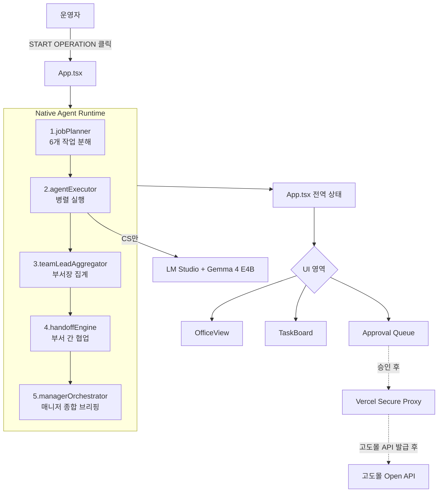

# GODO AI OS — 마스터 보고서

> **작성일**: 2026-06-22
> **버전**: v3 (Native Agent Runtime + Drilldown UX + Light/Dark Theme 통합본)
> **목적**: 프로젝트 정체성 · 현재 아키텍처 · 에이전트 명세 · 디자인 작업 · 갭 분석 · 자율 학습 전략 · 다음 로드맵을 단일 문서로 정리.

---

## 0. 한 줄 정의

**GODO AI OS는 NHN 고도몰을 "고치는" 프로젝트가 아니라, 고도몰 *바깥에 붙는* 외부 AI 운영 보조 OS다.**
쇼핑몰 운영자 한 사람이 매일 반복하는 CS·주문·리뷰·재고·매출·마케팅 업무를 **9~10명의 AI 직원이 부서 단위로 분담·협업**해서 처리하고, **사람은 마지막 승인·결재만** 한다.

---

## 1. 프로젝트 정체성 & 철학

### 1.1 정체성

```
고도몰 기본 솔루션 (그대로 사용)
   ↓ Open API
GODO AI OS (외부 AI 운영 레이어)
   ↓ 분석·요약·초안·제안
운영자 (최종 승인)
   ↓ 승인된 경우
고도몰 API (실제 실행)
```

### 1.2 핵심 철학 3가지

1. **Human-in-the-loop** — 환불·쿠폰·가격·고객 답변 등 외부에 닿는 액션은 AI가 직접 못 누름. 무조건 Approval Queue 경유.
2. **Local-First Hybrid AI** — 반복 업무는 PC 안 Gemma(LM Studio)로 무료·로컬·PII 안전. 고난도 전략 분석만 클라우드 보조 (계획 단계).
3. **API Key Frontend 영영 금지** — 모든 인증키는 Vercel 환경변수 + Secure Proxy 서버 사이드. localStorage/sessionStorage 일절 저장 금지.

### 1.3 24/7 자율 협업 회사 비전

운영자가 매일 출근 안 해도, 부서 단위로 알아서 일하는 가상 회사.

```
00:00  매출 분석팀이 어제 매출 집계 → 마케팅팀 inbox
06:00  CS팀이 밤사이 들어온 문의 분석 → 답변 초안 생성 → Approval Queue
09:00  운영자가 출근해서 승인 + 거절 결재
       그동안 상품팀은 재고 위험 항목 모니터링
12:00  마케팅팀이 오전 매출 데이터로 캠페인 후보 도출 → Approval Queue
...
```

---

## 2. 현재 시스템 아키텍처

### 2.1 디렉토리 구조

```
D:\godo\
├── api/                           # Vercel Serverless Functions
│   ├── godomall/                 # 고도몰 Secure Proxy (Mock)
│   │   ├── health.ts             # 키 존재 여부 boolean 응답
│   │   ├── sync.ts               # 데이터 동기화
│   │   ├── orders.ts / inquiries.ts / reviews.ts / inventory.ts / sales.ts
│   └── _shared/
│       ├── secretGuard.ts        # 환경변수 검증
│       ├── piiMaskGuard.ts       # 서버 사이드 PII 마스킹
│       ├── proxyResponse.ts      # 응답 규격
│       └── mockProxyData.ts      # 샌드박스용 가짜 데이터
│
├── src/
│   ├── components/                # 모든 React 컴포넌트
│   │   ├── MainLayout.tsx        # 상단 헤더 + 좌·우 메인 뷰포트
│   │   ├── OfficeView.tsx        # 오늘의 운영 메인 (좌·중·우 3열)
│   │   ├── TeamOperationsBoard.tsx       # 좌측 부서 관제 보드 ⭐NEW
│   │   ├── DepartmentCommandPanel.tsx    # 부서 작업실 모달 ⭐NEW
│   │   ├── OperationBriefingModal.tsx    # 종합 브리핑 모달 ⭐NEW
│   │   ├── MetricDrilldownModal.tsx      # KPI 드릴다운 ⭐NEW
│   │   ├── HandoffDetailModal.tsx        # 부서 전달 상세 ⭐NEW
│   │   ├── TaskListModal.tsx             # 상태별 작업 리스트 ⭐NEW
│   │   ├── ApprovalListModal.tsx         # 상태별 승인 리스트 ⭐NEW
│   │   ├── ChatConsole.tsx               # 중앙 Operational Control Chat
│   │   ├── TaskBoard.tsx                 # 우측 Today's Tasks + Approval Queue
│   │   ├── AgentPanel.tsx                # AI 직원 명부 탭
│   │   ├── BrainPanel.tsx                # 업무 매뉴얼 탭
│   │   ├── StudioPanel.tsx               # AI 설정실 탭
│   │   ├── EnginePanel.tsx               # AI 두뇌 설정 탭
│   │   ├── DataPanel.tsx                 # 데이터 가져오기 탭
│   │   ├── CalendarPanel.tsx             # 운영일지 탭
│   │   ├── ApiBridgePanel.tsx            # 쇼핑몰 연동 탭
│   │   ├── AgentDetailModal.tsx          # 에이전트 상세 모달
│   │   ├── TaskResultModal.tsx           # 작업 상세 모달
│   │   └── ApprovalDetailModal.tsx       # 승인 상세 모달
│   │
│   ├── engine/                            # 비즈니스 로직
│   │   ├── nativeAgentRuntime/           # ⭐NEW 에이전트 런타임
│   │   │   ├── types.ts                  # 부서/에이전트/Job/Result/Handoff 타입
│   │   │   ├── jobPlanner.ts             # 작업 분해 (현재 하드코딩)
│   │   │   ├── agentExecutor.ts          # 에이전트별 실행 (현재 if/else)
│   │   │   ├── teamLeadAggregator.ts     # 팀장 결과 집계
│   │   │   ├── handoffEngine.ts          # 부서 간 협업
│   │   │   ├── managerOrchestrator.ts    # 매니저 종합 브리핑
│   │   │   ├── nativeAgentRuntime.ts     # 메인 진입점
│   │   │   └── validationScenarios.ts    # 검증 시나리오 4종
│   │   ├── csDraftGenerator.ts           # CS 답변 초안 (Gemma 호출)
│   │   ├── taskPlanner.ts / taskRouter.ts / taskExecutor.ts  # 레거시 (사실상 미사용)
│   │   ├── reportComposer.ts             # 일일 보고서 생성
│   │   └── modelRouter.ts                # 라우팅 룰
│   │
│   ├── services/
│   │   ├── lmsConnector.ts               # LM Studio /v1/models, /v1/chat/completions
│   │   └── mockGodomallApi.ts            # 고도몰 Mock Adapter
│   │
│   ├── data/                              # 기본값 데이터
│   │   ├── defaultNativeAgentRuntime.ts  # ⭐NEW 부서·에이전트 정의
│   │   ├── agents.ts                     # 레거시 9 에이전트
│   │   ├── brainKnowledge.ts             # 14개 지식 문서
│   │   ├── defaultStudioData.ts          # 스킬/도구/권한
│   │   ├── defaultEngineData.ts          # 엔진 모드/Provider/라우팅
│   │   └── defaultOperationsData.ts      # 데모 운영 데이터
│   │
│   ├── hooks/
│   │   └── useTheme.ts                   # ⭐NEW Dark/Light 토글
│   │
│   ├── types/                            # 도메인 타입
│   ├── utils/                            # PII 마스킹, 데이터 정규화
│   └── App.tsx                           # 루트 상태/이벤트 허브
│
└── docs/
    ├── PROJECT_STATE.md                  # v1
    ├── PROJECT_STATE_COMPLETE_2026-06-22.md  # v2
    └── MASTER_REPORT_2026-06-22.md       # ⭐NEW v3 (본 문서)
```

### 2.2 데이터 흐름 (현재 구현 기준)



---

## 3. 에이전트 명세 (10명 / 4부서)

### 3.1 부서 구성

| 부서 ID | 이름 | 역할 |
|---|---|---|
| `manager` | 본부 / 오케스트레이션 | 전체 조율·승인·종합 브리핑 |
| `product` | 상품관리팀 | 상품/재고/판매 분석 |
| `cs` | CS 운영팀 | 문의 응대·리뷰 감성·이슈 감지 |
| `marketing` | 마케팅 기획팀 | 트렌드 조사·세그먼테이션·캠페인 기획 |

### 3.2 에이전트별 상세

#### 본부 (1명)

| 에이전트 | 역할 | 핵심 스킬 | 모델 | 입력 | 출력 |
|---|---|---|---|---|---|
| **총괄 매니저 AI** (`manager_agent`) | manager | 태스크 오케스트레이션 / 종합 운영 분석 / 인간 에스컬레이션 | local_gemma | 부서장 보고 3건 + handoff 5건 | 종합 브리핑 텍스트 + 승인 후보 추출 |

#### 상품관리팀 (3명)

| 에이전트 | 역할 | 핵심 스킬 | 입력 → 출력 |
|---|---|---|---|
| **상품관리 팀장 AI** (`product_lead`) | team_lead | 부서 태스크 관리, 카탈로그 리포팅, Handoff 조율 | 팀원 결과 → 부서 요약 보고서 |
| **상품 데이터 분석 AI** (`product_analyst`) | team_member | SEO 키워드 분석, 상품 규격화, 판매 이상 감지 | orders[] → SEO 매핑/판매 추이 |
| **재고/판매상태 감시 AI** (`inventory_monitor`) | team_member | 재고 실시간 모니터링, 소진 기한 예측, 발주서 자동 포맷팅 | inventory[] → 안전재고 미달 경보 + 발주 제안서 (`approval_required`) |

#### CS 운영팀 (3명)

| 에이전트 | 역할 | 핵심 스킬 | 입력 → 출력 |
|---|---|---|---|
| **CS 팀장 AI** (`cs_lead`) | team_lead | CS 워크플로우 통제, 에스컬레이션, 지표 종합 | 팀원 결과 → CS 부서 요약 |
| **문의 분석 AI** (`inquiry_analyst`) | team_member | 감정 분석, 답변 초안 생성, FAQ 매핑 | inquiries[] → **실제 Gemma 호출**로 답변 초안 (`cs_reply_draft` Artifact, `approval_required`) |
| **리뷰/이슈 감지 AI** (`review_detector`) | team_member | 리뷰 톤 분석, 브랜드 리스크, 사과문 초안 | reviews[] → 별점 ≤2 부정 리뷰 감지 + 사과 초안 (`approval_required`) |

#### 마케팅 기획팀 (3명)

| 에이전트 | 역할 | 핵심 스킬 | 입력 → 출력 |
|---|---|---|---|
| **마케팅 팀장 AI** (`marketing_lead`) | team_lead | 마케팅 믹스 전략, 협업 데이터 융합, ROI 기획 | 팀원 결과 + 타 부서 handoff → 보정된 캠페인안 |
| **시장/트렌드 리서치 AI** (`trend_researcher`) | team_member | 구매 패턴 세그먼테이션, 내부 트렌드, 경쟁사 카탈로그 | orders[] → 인기 품목·재구매 세그먼트 (⚠️ 외부 검색 미연동) |
| **콘텐츠/캠페인 기획 AI** (`campaign_planner`) | team_member | 쿠폰 발행 조건 설계, 메시지 카피라이팅, 이벤트 디자인 | 트렌드 분석 + handoff → 캠페인 기획서 (`marketing_plan` Artifact, `approval_required`) |

### 3.3 위험도 분류 (Approval 분기 기준)

```typescript
type AgentActionRisk =
  | 'auto_safe'           // 분석·요약 — 자동 실행 OK
  | 'draft_only'          // 초안만 작성 — 실행 안 함
  | 'approval_required'   // 운영자 승인 후에만 실행
  | 'manual_only';        // AI 실행 절대 금지 — 사람만
```

현재 작업별 위험도:
- `auto_safe`: 상품 데이터 분석, 리뷰 감지, 트렌드 리서치
- `draft_only`: 재고 시뮬레이션
- `approval_required`: CS 답변, 캠페인 기획, 발주 제안

---

## 4. Native Agent Runtime — 동작 메커니즘

### 4.1 6단계 흐름

```
[START OPERATION 클릭]
       ↓
1. planJobs(runId, objective, agents)
   → 6개 AgentJob 생성 (현재 하드코딩 defaultTaskSpecs)
       ↓
2. agentExecutor.executeAgentJob() × 6 (Promise.all 병렬)
   → 각 에이전트가 자기 데이터 분석 → AgentResult 생성
   → CS 답변만 실제 Gemma 호출, 나머지는 if/else 규칙
       ↓
3. teamLeadAggregator (부서별 × 3)
   → product / cs / marketing 팀장이 팀원 결과 집계
       ↓
4. handoffEngine.processHandoffs()
   A. product → marketing : 재고 부족·인기 품목 전달
   B. cs → marketing      : 부정 리뷰·브랜드 리스크 전달
   C. marketing 결과 자동 보정 (재고 부족 품목은 캠페인에서 제외)
   D. marketing → manager : 보정된 캠페인안 결재 상신
   E. product → manager   : 긴급 발주 결재 요청
   F. cs → manager        : CS 답변·부정 리뷰 결재 요청
       ↓
5. managerOrchestrator.orchestrateManager()
   → 부서별 상태 요약 + handoff 흐름 + 우선 지침 → 종합 브리핑 텍스트
   → approvalRequired Artifact를 Approval Queue 후보로 분리
       ↓
6. App.tsx에서 결과 수신 → UI 반영
   - 좌측 TeamOperationsBoard: 부서별 KPI 칩 + 최근 협업
   - 중앙 ChatConsole: 매니저가 브리핑 메시지 송출
   - 우측 TaskBoard: Today's Tasks + Approval Queue 갱신
```

### 4.2 협업 흐름 다이어그램

```
┌─────────────┐         ┌─────────────┐
│ 상품관리팀  │────────▶│  마케팅팀   │
│ 재고/판매   │ Handoff │             │
└──────┬──────┘         └──────┬──────┘
       │                       │
       │ 결재                  │ 결재
       ▼                       ▼
       ┌─────────────────────┐
       │     매니저 HQ       │
       │ 종합 브리핑 + 결재   │
       └─────────────────────┘
       ▲                       ▲
       │ 결재                  │
       │                       │
┌──────┴──────┐                │
│   CS팀      │────────────────┘
│ 답변/리뷰    │ Handoff (부정 리뷰)
└─────────────┘
```

### 4.3 Validation Scenarios (검증 시나리오 4종)

`validationScenarios.ts`에 정의:

1. **normal**: 정상 운영 (재고 양호, 미답변 0, 평점 5)
2. **low_stock**: 시그니처 세트·마사지 오일 재고 고갈 → 마케팅 캠페인 자동 배제
3. **cs_negative**: 마사지 오일 피부 트러블 민원 → 마케팅 보류
4. **disabled_marketing**: 마케팅 에이전트 전체 비활성화

→ 개발자 검증 도구 (좌측 보드 하단 접힘 패널)에서 선택 가능.

---

## 5. 로컬 LLM Bridge (Gemma)

### 5.1 환경

```
LM Studio endpoint     : http://localhost:1234/v1
Vite proxy             : /lmstudio/v1 → http://localhost:1234/v1
실제 모델 ID           : google/gemma-4-e4b
임베딩 모델             : text-embedding-nomic-embed-text-v1.5
```

### 5.2 구현 위치

- `src/services/lmsConnector.ts` — `/v1/models` 조회, `/v1/chat/completions` 호출, fallback 가드
- `src/engine/csDraftGenerator.ts` — CS 답변 초안 생성 (PII 마스킹 후 프롬프트 조립 → Gemma 호출 → 결과 파싱)
- `src/components/EnginePanel.tsx` — 연결 상태 시각화 (LOCAL LLM READY 표시등)

### 5.3 현재 LLM 활용 범위

⚠️ **CS 답변 초안 한 곳에서만 실제 호출.** 나머지 8 에이전트는 if/else 규칙 기반.

---

## 6. UI/UX 작업 (이번 세션 결과)

### 6.1 Drilldown UX (작업 지시서 §1~§17)

| 작업 | 결과 |
|---|---|
| START OPERATION 단일화 | 상단 헤더 하나만 유지, TaskBoard·TeamOperationsBoard의 보조 버튼 모두 제거 |
| 부서 카드 KPI 4종(진행/완료/전달/승인) 클릭 가능 | `TeamOperationsBoard` → `MetricDrilldownModal` |
| 부서 보기 ↔ KPI 클릭 역할 분리 | 부서 보기 = `DepartmentCommandPanel`(작업실 전체), KPI = `MetricDrilldownModal`(필터 단일 뷰) |
| 최근 부서 협업 클릭 | `HandoffDetailModal` |
| 종합 브리핑 모달 내부 항목 클릭 | 알람 박스 → 승인 드릴다운 / 부서 결과 카드 → MetricDrilldown / 전달 카드 → HandoffDetail (nested modal, z-index 1100 < 1200 < 1300) |
| Today's Tasks 상태 요약 4칩 (대기/진행/검토/완료) | `TaskListModal` |
| Approval Queue 상태 요약 4칩 (대기/승인/거절/전체) | `ApprovalListModal` |
| 검증 시나리오 패널 기본 숨김 | 좌측 보드 하단 "🔧 개발자 검증 도구" 접힘 패널 |
| Empty state 친화 문구 | "운영 시작을 누르거나 총괄 매니저에게 업무를 지시해 주세요" 등 |

### 6.2 Dark/Light 테마 시스템

#### 구조
- `src/hooks/useTheme.ts` — `'dark' | 'light'` state + `document.documentElement.dataset.theme` 반영 + `localStorage.godo.ui.theme` 저장
- `src/index.css` — `:root, [data-theme='dark']` / `[data-theme='light']` 두 토큰 세트
- 토글 버튼 위치: MainLayout 헤더 우상단

#### CSS 변수 토큰 (요약)

```css
/* Dark Neon */
--bg-app: #050809
--text-primary: #eefaf5
--accent-primary: #2df5a2

/* Light Clean */
--bg-app: #f0f4f5
--text-primary: #0d1f1a
--accent-primary: #00a878
--accent-primary-2: #008f66
```

### 6.3 라이트 모드 정돈 (3회에 걸친 패치)

**1차**: 메인 운영 화면 — 헤더 nav-tabs / viewport-left / ChatConsole 다크 패치 매핑, 좌측 KPI 칩 흰 카드화, 폰트 위계 정돈 (`chip-num` 13→15px, `summary-num` 16→18px, JetBrains Mono).

**2차**: 8개 탭 + 5개 모달 전수 라이트 오버라이드 — AgentPanel / DataPanel / CalendarPanel / ActivityLog / BrainPanel / StudioPanel / EnginePanel / ApiBridgePanel / AgentDetailModal / TaskResult / ApprovalDetail / ReportModal.

**3차 — 형광 텍스트 사냥**: 사용자 스샷(2.png) 피드백으로 발견된 잔존 형광 텍스트 일괄 처리.
- CSS 라이트 오버라이드가 무력화된 원인 = **인라인 `style={{ color: '#00ff88' }}` 하드코딩**
- 5개 tsx 파일에서 인라인 형광 색 모두 시맨틱 클래스로 교체:
  - `.td-sales-strong`, `.td-orig-strong`, `.td-required`, `.data-section-h3`, `.api-mock-info`
  - `.accent-strong`, `.warning-strong`, `.health-score-strong`
  - `.risk-strong-danger`, `.status-strong-warning`, `.missing-fields-strong`
- 다크 = 액센트 유지 / 라이트 = 검정 / 의미 색(success/warning/danger) = 양 모드 동일

#### 라이트 모드 디자인 원칙
- **헤더/카드 제목** = 검정 (`var(--text-primary)`)
- **의미 색** = 차분한 톤 (`var(--success)`=#059669, `var(--warning)`=#d97706, `var(--danger)`=#dc2626)
- **강조** = 배경/보더로 (텍스트 색은 가독성 우선 검정)
- **다크 모드** = 기존 네온 디자인 그대로 유지

#### 빌드 메트릭 추이
- 초기: `CSS 176kB`
- Drilldown 추가 후: `CSS 188kB`
- 라이트 모드 전수 패치 후: `CSS 215kB`
- 최종 (형광 정돈 후): `CSS ~217kB / JS 640kB / gzip 174kB`

---

## 7. 갭 분석 — "회사 시뮬레이터"에서 "회사 OS"로

비전과 현 구현의 7가지 갭. 우선순위 순.

### 갭 #1. 자율 발화 (트리거) 없음 ⭐ 최우선
- **현재**: 사용자가 START 클릭해야만 작동. `setInterval` 없음, 워치독 없음.
- **비전**: "댓글 달리면 CS팀 자동 발화", "재고 5개 미만이면 상품팀 자동 발화", "매일 00:00 매출 분석 자동"
- **필요**: cron 스케줄러 + 데이터 변경 감지 워치독 (고도몰 API polling 또는 webhook)

### 갭 #2. 에이전트가 실제로 사고하지 않음 ⭐ 최우선
- **현재**: `agentExecutor.ts`는 거대한 if/else 분기. `product_analyst`는 `orders.length`만 세고 `topSelling`만 정렬. CS 답변만 Gemma 호출.
- **비전**: 모든 에이전트가 자기 system prompt + 부서 데이터 → Gemma에게 던지고 결과 받아 처리.
- **필요**: agentExecutor를 LLM 호출 기반으로 리팩토링 (에이전트별 프롬프트 템플릿 + Gemma + 결과 파싱)

### 갭 #3. 작업 분해가 하드코딩
- **현재**: `jobPlanner.ts`는 6개 작업 고정 배열. objective가 무엇이든 같은 6개.
- **비전**: 매니저가 LLM으로 상황 진단 → "오늘은 CS 30건 쌓였으니 CS 2배 투입, 상품팀은 짧게" 같은 동적 분배.
- **필요**: 매니저 에이전트가 LLM 호출로 JobPlan 동적 생성

### 갭 #4. handoff가 batch 안에서만 흐름 (메시지 큐 없음) ⭐ 최우선
- **현재**: 모든 부서가 한 사이클 안에서 일괄 handoff → 매니저 보고 → 종료.
- **비전**: "마케팅팀이 어제 받은 상품팀 handoff를 오늘 아침에 소화" 같은 비동기 메시지박스.
- **필요**: 부서별 inbox (LocalStorage 또는 SQLite/IndexedDB) + 다음 사이클에서 소화 로직

### 갭 #5. 장기 기억 없음
- **현재**: `lastNativeAgentRun` localStorage에 마지막 1건만. Studio의 Memory 필드는 정의만 있고 미사용.
- **비전**: "지난주 클레임 패턴", "어제 추천한 캠페인 결과" → 다음 결정에 반영
- **필요**: run history 누적 DB + 에이전트별 메모리 슬롯 + 벡터 검색 (RAG)

### 갭 #6. 외부 도구 어댑터 없음
- **현재**: `trend_researcher` 코드에 자기가 인정: *"외부 검색 도구 미연동 상태로 내부 데이터 기반 분석만 수행"*
- **비전**: 웹 검색, 경쟁사 가격 모니터링, SNS 트렌드 수집, 블로그·인스타 자동 포스팅
- **필요 어댑터**:
  - Google Search API / Naver Open API
  - 블로그 RSS 수집기
  - SNS 자동 포스팅 (Buffer / Make / Zapier 식)
  - Gemini / Claude Cloud 어댑터 (Secure Proxy 경유)

### 갭 #7. 승인 후 "실제 실행" 파이프라인 없음
- **현재**: Approval → 카드 색만 바뀜. 실제 외부 액션 안 일어남.
- **비전**: Approval → Secure Proxy → 고도몰 API write → 감사 로그.
- **필요**: Approval action dispatcher (고도몰 API 키 발급 후)

---

## 8. 자율 학습 & 장기 기억 전략

### 8.1 두 가지 갈래

| 방식 | 난이도 | 효과 | 추천 |
|---|---|---|---|
| **RAG식 가짜 학습** | 쉬움 | 운영자 체감 "어제보다 잘함" 가능 | ⭐ |
| **파인튜닝** | 어려움 | 진짜 모델 가중치 변경 | 비추 |

### 8.2 RAG식 학습 권장 설계

```
┌─────────────────────────────────────────┐
│ 매일 NativeAgentRun 결과               │
│ - jobs, results, handoffs, briefing    │
│ - 운영자 승인/거절 액션                 │
└────────────────┬────────────────────────┘
                 │ 저장
                 ▼
┌─────────────────────────────────────────┐
│ SQLite / Postgres + 벡터 인덱스        │
│ (text-embedding-nomic으로 임베딩)       │
└────────────────┬────────────────────────┘
                 │ 다음날 prompt 조립 시
                 ▼
┌─────────────────────────────────────────┐
│ "유사 상황 과거 처리 사례" 검색         │
│ → 에이전트 프롬프트에 자동 주입         │
└────────────────┬────────────────────────┘
                 ▼
        Gemma 호출 (개선된 출력)
```

### 8.3 학습 대상 데이터

- **에이전트 결정 이력**: "이런 입력에서 이런 결정을 했음"
- **운영자 승인/거절 패턴**: "운영자가 어떤 초안은 늘 거절함" → 다음에 안 만듦
- **handoff 효과성**: "이 handoff 후 매출 +5%" → 가중치
- **에러 회피**: 실패한 작업은 같은 입력에서 다른 경로 시도

### 8.4 인프라 후보

| 구성 요소 | 후보 |
|---|---|
| 저장소 | SQLite (로컬) / Postgres (Vercel Postgres) / IndexedDB (브라우저) |
| 임베딩 | LM Studio에 이미 설치된 `text-embedding-nomic-embed-text-v1.5` |
| 벡터 검색 | sqlite-vss / pgvector / 단순 코사인 유사도 |
| ORM | Drizzle / Prisma (선택) |

---

## 9. 다음 단계 로드맵

### Phase 1 — "회사 시뮬레이터 → 회사 OS" (고도몰 API 발급 대기 중 작업)

**우선순위 최상 — 이 3개만 들어가도 자율 협업 OS 수준**

1. **갭 #2: LLM 사고 전환**
   - `agentExecutor.ts`를 if/else에서 Gemma 호출 기반으로 리팩토링
   - 각 에이전트마다 system prompt 파일 + 입력 마샬링 + 결과 파싱 표준화
2. **갭 #1: 트리거**
   - 단순 cron부터 (예: 30분마다 자동 cycle)
   - 사용자가 종료 안 하면 자동 실행
3. **갭 #4: 메시지 큐**
   - 부서별 inbox (LocalStorage → 나중에 SQLite로 마이그)
   - 받은 메시지가 다음 사이클의 작업 후보가 됨

### Phase 2 — 고도몰 READ Bridge (API 키 발급 후)

4. Vercel Secure Proxy에서 POST+XML 요청 어댑터 구현
5. XML 파서 (`fast-xml-parser`) → StandardProduct/Order/Inquiry로 변환
6. PII 마스킹 후 프론트엔드 반환
7. 상품조회 PoC → 주문조회 → 게시판 조회 확장

### Phase 3 — 장기 기억 DB

8. **갭 #5**: run history SQLite + 임베딩 + 벡터 검색
9. RAG 프롬프트 조립 로직
10. Studio에서 에이전트별 메모리 시각화

### Phase 4 — 외부 도구 어댑터

11. **갭 #6**: 마케팅팀 외부 검색 (Google/Naver) → 트렌드 자동 수집
12. SNS·블로그 자동 포스팅 어댑터
13. Cloud LLM (Gemini Pro) Secure Proxy 경유 호출

### Phase 5 — WRITE Action (실제 운영 투입)

14. **갭 #7**: Approval → 고도몰 API write → 감사 로그
15. 게시물 답변 등록 / 주문 상태 변경 / 재고 수정 / 가격 변경 / 쿠폰 발행

---

## 10. 현재 인프라 / 배포 상태

| 항목 | 상태 |
|---|---|
| GitHub Repository | `papa6229-beep/godo` |
| Vercel Production | `godo-psi.vercel.app` |
| Vercel Secure Proxy | 활성 (`/api/godomall/health` 200 OK 응답) |
| LM Studio + Gemma | 로컬 (`http://localhost:1234/v1`) |
| 고도몰 테스트몰 | `https://locostar76.godomall.com/` (샘플 상품 12개) |
| 고도몰 Open API | 개발자 등록 신청 완료, **승인 대기** |
| 검증 명령 | `npm run lint` ✅ `npx tsc --noEmit` ✅ `npm run build` ✅ |

---

## 11. 보안 원칙 (변경 금지)

```
❌ 프론트엔드 코드 하드코딩  ❌ localStorage 저장
❌ sessionStorage 저장        ❌ indexedDB 저장
❌ 브라우저 전역 상태 저장    ❌ 로그 출력
❌ 응답 JSON에 원본 키 포함

✅ Vercel 환경변수만
✅ Secure Proxy 서버 사이드 사용
✅ health endpoint에서 boolean만 반환
✅ PII는 마스킹 후 LLM 전달
✅ Cloud AI에는 비식별 데이터만
```

---

## 12. 한 페이지 요약

**GODO AI OS는 고도몰 옆에 붙는 외부 AI 운영 보조 OS.**

10명의 AI 직원(매니저 + 상품 3 + CS 3 + 마케팅 3)이 4부서로 나뉘어 부서장 집계 + 부서 간 handoff + 매니저 종합 브리핑까지 한 사이클을 자동으로 수행. **위험 작업은 Approval Queue를 거쳐 사람이 결재**.

조직도와 협업 회로는 완성됐고, UI(Drilldown + Dark/Light 테마)도 정돈 완료. **다만 지금은 START 버튼을 눌러야만 정해진 각본대로 1회 작동하는 "회사 시뮬레이터"**. 진짜 24/7 자율 협업 OS가 되려면 **(1) LLM 사고 전환 (2) 자율 트리거 (3) 메시지 큐**가 들어가야 함.

고도몰 API 키 발급 대기 중인 지금이 위 세 가지 작업의 적기.

**다음 우선순위**:
1. agentExecutor를 Gemma 기반으로 리팩토링
2. cron 스케줄러로 자율 발화
3. 부서별 inbox 메시지 큐
4. (API 발급 후) 고도몰 READ Bridge
5. RAG 장기 기억 DB
6. 외부 도구 어댑터
7. WRITE Action 파이프라인

---

*문서 끝.*
