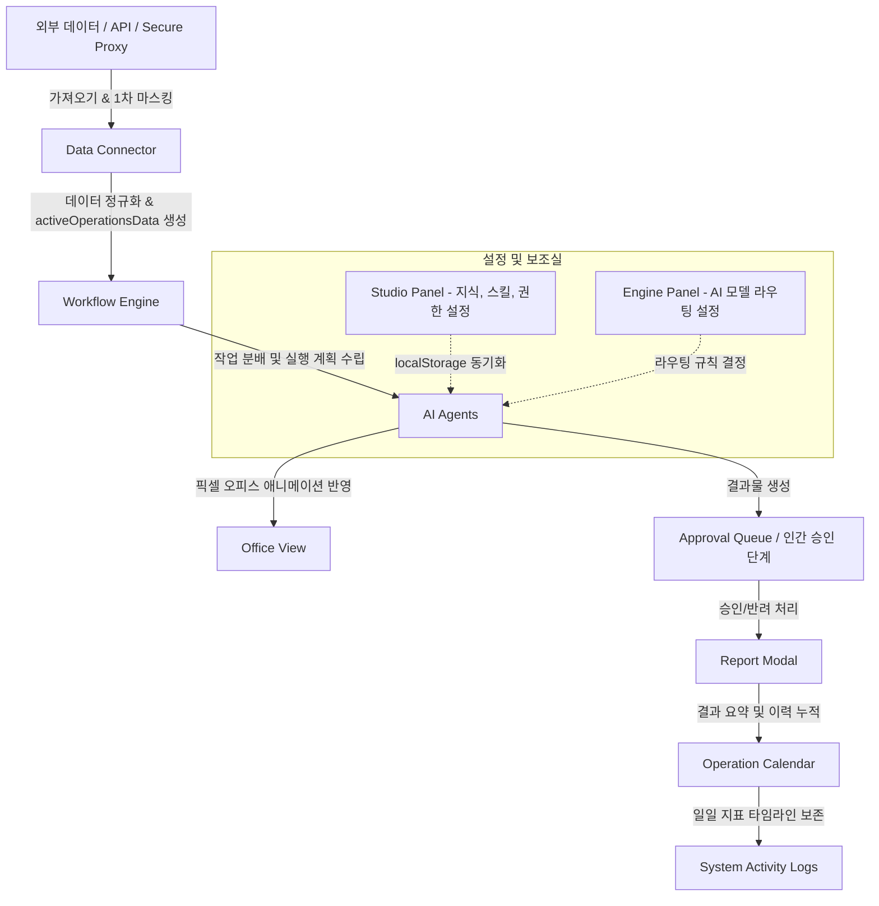

# GODO AI OS Project State

이 문서는 **GODO AI OS** 프로젝트의 현재 개발 상태, 시스템 아키텍처, 구현 명세, 핵심 철학 및 보안 원칙, 향후 로드맵을 상세히 보존하고 인수인계하기 위해 작성된 마스터 컨텍스트 문서입니다. 새로운 AI 세션, Antigravity 에이전트, 혹은 신규 개발자가 이 문서 하나만으로 프로젝트의 컨텍스트를 즉시 파악하고 개발을 원활하게 이어나갈 수 있도록 돕는 것을 목적으로 합니다.

---

## 1. 프로젝트 개요

*   **프로젝트명**: GODO AI OS
*   **목적**: NHN 고도몰(GodoMall) 기반 쇼핑몰의 반복적이고 복잡한 운영 업무(주문, CS, 리뷰, 재고, 매출, 마케팅 등)를 다중 AI 에이전트 협업 체계를 통해 보조하고 자동화하는 통합 AI 운영센터입니다.
*   **핵심 메시지**: **"AI 직원들이 실무(수집, 분석, 요약, 초안 작성)를 담당하고, 사람은 최종 검토, 의사결정 및 승인(Human-in-the-loop)을 수행한다."**
*   **현재 상태 (2026-06-25 기준, main HEAD `7965df1`)**: 샌드박스 MVP를 넘어, 고도몰 Products/Orders **REAL READ** + RevenueOrder/Synthetic 매출·재고 파이프라인이 main에 반영되었고, **실제 AI 두뇌(Claude/OpenAI/Gemini 클라우드 + LM Studio 로컬)를 GODO 화면에서 연결**해 운영 채팅·AI 직원·부서 팀장 채팅이 그 두뇌로 실제 대화하는 단계까지 도달했습니다. 기본 AI는 Claude. 상품관리팀 채팅은 데이터 기반(facts) 응답, 상품 대시보드 매출 추이 필터도 정리 완료. 클라우드 키는 서버 route(`/api/ai/chat`) 경유·미저장 원칙. **상세·다음 작업은 `docs/PROJECT_HANDOFF_2026-06-25.md` 참조.**

---

## 2. 초기 구상과 참고 모델

*   **참고 모델**: 커넥트 AI(Connect AI) 또는 'a.i제이'와 같은 다중 에이전트 기반의 비주얼 협업 모델을 지향합니다.
*   **픽셀아트 사무실 UI ([PixelOfficeView.tsx](file:///d:/godo/src/components/PixelOfficeView.tsx))**: 
    *   2D 픽셀아트 기반의 가상 사무실 뷰를 제공하여, AI 직원(에이전트)들이 각자의 책상에서 업무를 수행하는 시각적 피드백을 구현했습니다.
    *   에이전트들이 작업을 수행할 때 활성화 상태(점멸, 말풍선 생성, 모션)로 변경되며 완료 후 대기(Idle) 상태로 복귀하는 등의 인터랙션이 구현되어 있습니다.
*   **에이전트 분업 아키텍처**:
    *   단일 거대 프롬프트가 아닌, 세분화된 역할을 가진 9명의 특화 AI 에이전트가 협동하여 전체 운영 작업을 수행합니다.
    *   각 에이전트는 **역할(Role)**, **상태(Stats)**, **시스템 프롬프트(System Prompt)**, **참조 지식(Knowledge)**, **실행 스킬(Skills)**, **도구(Tools)**, **작업 권한(Permissions)**, **작업 기억(Memory)**의 독립적인 구성 요소를 갖추고 동작합니다.
*   **워크플로우 흐름**:
    *   사용자의 운영 지시(START OPERATION) ➡️ 테스크 플래너 ➡️ 에이전트 작업 실행 ➡️ 에이전트 행동 로그 축적 ➡️ 작업 승인 큐(Approval Queue) 전송 ➡️ 일일 보고서(Report Modal) 생성 ➡️ 캘린더 이력 저장의 라이프사이클을 가집니다.

---

## 3. 핵심 제품 철학

1.  **비즈니스 흐름 중심의 UI**: 쇼핑몰 운영자는 복잡한 AI 기술 파라미터나 원시 프롬프트보다 자신이 관리해야 하는 업무의 상태, 데이터의 유출 여부, 그리고 최종 산출물의 승인 여부를 가장 먼저 확인해야 합니다.
2.  **보안 및 프라이버시 우선 (PII Guard)**: 고객의 개인식별정보(PII - 이름, 전화번호, 이메일, 주소 등)는 절대 로컬 가공 과정 없이 외부 LLM(Cloud AI)이나 클라이언트로 노출되지 않습니다. 모든 PII는 Secure Proxy 혹은 Local normalizer 수준에서 1차 마스킹 처리합니다.
3.  **Human-in-the-loop (승인 기반 실행)**: 환불 처리, 상품 가격 변경, 쿠폰 발행, 최종 CS 답변 등록과 같은 고위험 액션은 AI가 직접 실행할 수 없으며, 반드시 운영자의 승인을 거쳐야만 실제 쇼핑몰에 반영됩니다.
4.  **Local-First Hybrid AI**: 일상적인 CS 분류, 메일 요약, 단순 재고 경보 등은 사용자의 PC 내부망이나 로컬 서버의 경량 모델(Gemma + LM Studio)을 무료로 우선 활용하고, 마케팅 전략 수립이나 방대한 트렌드 조사 등 고성능 요구 작업만 선택적으로 Cloud AI(Gemini/Claude 등)에 의뢰하여 운영 비용을 최적화합니다.

---

## 4. 전체 시스템 구조 및 데이터 흐름

GODO AI OS의 전반적인 데이터 및 메시지 흐름은 다음과 같습니다.



---

## 5. 구현 완료 Phase 요약

| Phase | 목적 | 구현 결과 | 주요 소스 파일 |
| :--- | :--- | :--- | :--- |
| **OFFICE Dashboard** | 운영 실무 현황 모니터링 및 시뮬레이션 | 픽셀 오피스, 작업 진행 판, 승인 대기열, 실시간 로그의 유기적 배치 완료 | [MainLayout.tsx](file:///d:/godo/src/components/MainLayout.tsx)<br>[PixelOfficeView.tsx](file:///d:/godo/src/components/PixelOfficeView.tsx)<br>[TaskBoard.tsx](file:///d:/godo/src/components/TaskBoard.tsx)<br>[ActivityLog.tsx](file:///d:/godo/src/components/ActivityLog.tsx) |
| **AGENTS 시스템** | 분업형 AI 구동 체계 구현 | 9인의 AI 직원별 인지 그리드(Skills, Permissions, Memory 등) 구성 및 렌더링 | [AgentPanel.tsx](file:///d:/godo/src/components/AgentPanel.tsx)<br>[AgentDetailModal.tsx](file:///d:/godo/src/components/AgentDetailModal.tsx)<br>[agents.ts](file:///d:/godo/src/data/agents.ts) |
| **BRAIN 지식 인덱스** | RAG 모델을 모사한 지식 계층 구현 | CS 정책, 배송 지침, 환불 가이드 등 14개 마크다운/JSON 지식 문서 관리 체계 구현 | [BrainPanel.tsx](file:///d:/godo/src/components/BrainPanel.tsx)<br>[brainKnowledge.ts](file:///d:/godo/src/data/brainKnowledge.ts) |
| **STUDIO 설정실** | 사용자의 무코드 설정 조정 | 코드 수정 없이 브라우저 내에서 지식, 에이전트, 스킬, 도구 설정을 변경하고 백업/복원 | [StudioPanel.tsx](file:///d:/godo/src/components/StudioPanel.tsx)<br>[defaultStudioData.ts](file:///d:/godo/src/data/defaultStudioData.ts) |
| **ENGINE 모델 라우터** | 지능적 작업 라우팅 시뮬레이션 | 작업 비용/보안 수준에 맞게 Local SLM, Cloud LLM, Human Gate 등으로 작업 분배 규칙 제어 | [EnginePanel.tsx](file:///d:/godo/src/components/EnginePanel.tsx)<br>[modelRouter.ts](file:///d:/godo/src/engine/modelRouter.ts) |
| **DATA CONNECTOR** | 파일 기반 운영 데이터 수집 | CSV/JSON 파일을 분석 및 정규화하고 PII(개인정보)를 로컬 수준에서 선제 마스킹 | [DataPanel.tsx](file:///d:/godo/src/components/DataPanel.tsx)<br>[dataNormalizer.ts](file:///d:/godo/src/utils/dataNormalizer.ts)<br>[privacyMask.ts](file:///d:/godo/src/utils/privacyMask.ts) |
| **WORKFLOW Binding** | 로드된 데이터와 워크플로우 결합 | 업로드 데이터 소스(Demo, CSV, API Mock)를 워크플로우에 결합하여 실제 수치와 연동 | [taskExecutor.ts](file:///d:/godo/src/engine/taskExecutor.ts)<br>[reportComposer.ts](file:///d:/godo/src/engine/reportComposer.ts) |
| **OPERATION CALENDAR** | 일단위 운영 이력 추적 | 날짜별 Daily Brief, 이슈 타임라인, 데이터 소스 뱃지, 마스킹된 운영 요약 히스토리 관리 | [CalendarPanel.tsx](file:///d:/godo/src/components/CalendarPanel.tsx)<br>[dailySummaryBuilder.ts](file:///d:/godo/src/utils/dailySummaryBuilder.ts) |
| **API BRIDGE** | 가상 고도몰 API 어댑터 인프라 | Mock 쇼핑몰 API를 샌드박스로 연결하여 리소스 동기화 상태, 권한 게이트 시뮬레이션 제공 | [ApiBridgePanel.tsx](file:///d:/godo/src/components/ApiBridgePanel.tsx)<br>[mockGodomallApi.ts](file:///d:/godo/src/services/mockGodomallApi.ts) |
| **SECURE PROXY** | Vercel Serverless 기반 보안 프록시 | 민감 정보 유출 차단 및 API 키 보호를 위해 Vercel Serverless Function으로 래핑된 프록시 API 구축 | [api/godomall/health.ts](file:///d:/godo/api/godomall/health.ts)<br>[api/_shared/piiMaskGuard.ts](file:///d:/godo/api/_shared/piiMaskGuard.ts) |
| **SECURE PROXY Runtime Fix** | Vercel ESM 환경 대응 픽스 | ESM 환경의 상대경로 모듈 누락 및 프론트엔드 코드 의존 문제 해결 | [api/_shared/secretGuard.ts](file:///d:/godo/api/_shared/secretGuard.ts) |
| **UX Simplification** | 운영자 편화적 메뉴/용어 개편 | 대시보드 내 기술 지향적 명칭을 비즈니스 및 운영 직관적 명칭으로 개편 | [MainLayout.tsx](file:///d:/godo/src/components/MainLayout.tsx) |

---

## 6. OFFICE 구현 상태

*   **역할**: 일일 운영 업무의 중심 대시보드로, 실행 상태 모니터링 및 에이전트 관제탑 역할을 합니다.
*   **START OPERATION 동작**: 
    *   사용자가 실행 버튼을 누르면 `taskPlanner.ts`와 `taskExecutor.ts`가 가동되어 미리 등록된 스케줄 테스크들(신규 주문 수집, CS 문의 답변 초안, 품절 재고 감지 등)을 순차적으로 수행합니다.
    *   현재는 시뮬레이션 및 데이터 바인딩 규칙에 따른 동작(Mock/Workflow 기반)이며, 실제 LLM API의 실시간 완성 호출은 아직 적용되지 않았습니다.
*   **TaskBoard ([TaskBoard.tsx](file:///d:/godo/src/components/TaskBoard.tsx))**: 진행 중인 태스크(예정, 진행 중, 보류, 완료) 카드가 시각적으로 표시되며, 현재 적용된 `DATA/SOURCE` 뱃지(Demo, CSV, API Mock 등)가 함께 노출됩니다.
*   **Approval Queue**: 사람이 개입하여 최종 실행 여부를 결정할 수 있도록 승인 대기중인 카드들이 누적됩니다. 승인(Approve) 또는 반려(Reject) 처리가 가능합니다.
*   **Activity Log ([ActivityLog.tsx](file:///d:/godo/src/components/ActivityLog.tsx))**: 에이전트의 구체적 의사결정 경로(참조한 지식, 발동한 스킬, 데이터 마스킹 여부 등)가 타임라인 형식의 실시간 텍스트 로그로 기록됩니다.
*   **ReportModal ([ReportModal.tsx](file:///d:/godo/src/components/ReportModal.tsx))**: 운영 완료 시 당일 자동 처리 수치, 승인 대기 건수, 위험 플래그 및 원본 데이터 기반 분석 요약을 다이어로그로 생성합니다.
*   **Pixel office live view**: 에이전트들이 지도 좌표를 따라 움직이며 책상에서 작업하는 모습을 픽셀아트로 시뮬레이션합니다.

---

## 7. AGENTS 구현 상태

GODO AI OS에는 9명의 AI 에이전트가 사전 정의되어 있습니다.

1.  **총괄 매니저 AI (Manager)**: 전체 운영 프로세스 조율, 리포트 생성 및 전반적인 스케줄 제어.
2.  **CS 상담 AI (CS Specialist)**: 고객 문의 분류, 정책 검색 기반 답변 초안 생성.
3.  **주문 확인 AI (Order Processor)**: 신규 주문 수집, 상태 확인 및 주문 이상 징후 분석.
4.  **배송 추적 AI (Delivery Tracker)**: 배송 지연 감지 및 송장 번호 매핑 상태 점검.
5.  **리뷰 답글 AI (Review Responder)**: 고객 리뷰 감성 분석 및 맞춤형 답글 초안 생성.
6.  **마케팅 기획 AI (Marketing Planner)**: 구매 이력 분석을 통한 재구매 캠페인 기획 및 타겟 쿠폰 초안 생성.
7.  **상품 관리 AI (Product Editor)**: 상품 정보 오류 스캔 및 승인 대기형 상품 수정 초안 생성.
8.  **재고 감시 AI (Inventory Monitor)**: 품절 위험 및 안전 재고 미달 예측, 발주 요청서 제안.
9.  **매출 분석 AI (Sales Analyst)**: 매출 실적 요약, 이상징후 요약 및 추세 분석.

### 에이전트 세부 속성 (Cognitive Grid)
각 에이전트는 다음과 같은 구조로 데이터화되어 관리되고 있습니다 ([agents.ts](file:///d:/godo/src/data/agents.ts)):
*   **Role (역할)**: 에이전트의 직무 정의 및 직급.
*   **Stats (스탯)**: 작업 수, 평점, 신뢰도 등 성능 요약.
*   **System Prompt (프롬프트)**: LLM 구동 시 주입될 페르소나 및 지침.
*   **Knowledge (지식)**: 에이전트가 접근 가능한 Brain 지식 카테고리.
*   **Skills (스킬)**: `cs_classification`, `sales_forecasting`, `pii_scan` 등 해당 직원이 활성화할 수 있는 특정 업무 능력 알고리즘.
*   **Tools (도구)**: `godo_api_client`, `email_sender`, `database_writer` 등 권한 부여를 제어하기 위한 API 도구 목록.
*   **Permissions (권한)**: `read_only`, `approval_required` 등 고위험 동작 통제 매트릭스.
*   **Memory (기억)**: 이전 작업 이력 및 컨텍스트 보존 공간.

---

## 8. BRAIN 구현 상태

에이전트들이 정책적 결정을 내릴 때 참고하는 가상의 RAG 지식 저장소입니다 ([BrainPanel.tsx](file:///d:/godo/src/components/BrainPanel.tsx)).
*   **구조**: RAG와 유사한 구조로 설계되어 검색어 입력, 카테고리 필터링, 우선순위 필터링이 가능합니다.
*   **등록된 기본 지식 문서 (14개)**:
    1.  `cs_policy.md`: 고객 응대 기본 지침 및 어조 가이드.
    2.  `delivery_policy.md`: 배송비 기준, 배송 지연 보상 지침.
    3.  `refund_exchange_policy.md`: 교환/반품 가능 기간 및 반송 택배비 정책.
    4.  `product_expression_rules.md`: 상품 고시 정보 표기 규정 및 유의사항.
    5.  `inventory_snapshot.json`: 현 시점의 위험 재고 수치 및 안전 재고 가이드라인.
    6.  `order_check_template.md`: 주문 검수 프로세스 단계별 템플릿.
    7.  `cs_auto_template.md`: 문의 유형별 상용구 답변 가이드.
    8.  `daily_operation_report.md`: 일일 운영 리포트 작성 가이드 및 규칙.
    9.  `campaign_result_report.md`: 마케팅 캠페인 효과 분석 양식.
    10. `cs_decision_log.md`: 과거 까다로웠던 클레임 대응 이력.
    11. `marketing_decision_log.md`: 진행했던 할인 이벤트의 매출 유도 결과 히스토리.
    12. `review_reply_template.md`: 리뷰 별점 및 어조에 따른 답변 예시 모음.
    13. `sales_report_template.md`: 월간/주간 매출 보고서 작성 포맷.
    14. `risk_handling_guide.md`: 시스템 경보(재고 고갈, 대량 클레임 등) 발생 시 에이전트 행동 지침.

---

## 9. STUDIO 구현 상태

*   **역할**: 운영자가 코드 수정이나 개발 툴 없이 브라우저상에서 AI 직원의 설정 및 운영 정책(Brain)을 완전히 커스터마이징할 수 있는 무코드(No-code) 설정 제어실입니다 ([StudioPanel.tsx](file:///d:/godo/src/components/StudioPanel.tsx)).
*   **탭 구성**:
    *   **Brain Editor**: 지식 문서 추가/수정/삭제 및 마크다운 편집.
    *   **Agent Editor**: 9명의 에이전트 시스템 프롬프트 및 스킬 매핑 수정.
    *   **Skill Registry**: 워크플로우 상에 사용되는 에이전트의 개별 스킬들을 편집 및 등록.
    *   **Tool Registry**: 에이전트들이 사용할 외부 도구 API 정의.
    *   **Permission Matrix**: 도구 사용 시 필요한 승인 수준(Auto, Approval Required, Manual Only) 통제.
    *   **Import / Export**: 변경된 모든 구성을 JSON 파일로 내보내거나 백업 파일에서 복원하는 기능.
*   **저장 원리**: 모든 데이터는 브라우저의 `localStorage`에 즉시 반영되며, 다음 키를 사용합니다.
    *   `godo.brainKnowledge`
    *   `godo.agents`
    *   `godo.skills`
    *   `godo.tools`
    *   `godo.permissionMatrix`
    *   `godo.studio.lastSavedAt`

---

## 10. ENGINE 구현 상태

*   **역할**: 각 에이전트가 어떤 LLM 엔진을 통해 업무를 처리할지 비용과 보안 가이드를 기준으로 결정하는 라우팅 허브입니다 ([EnginePanel.tsx](file:///d:/godo/src/components/EnginePanel.tsx)).
*   **Engine Modes (엔진 모드)**:
    1.  `Demo`: 로컬 및 클라우드 연결 없이 완전한 모킹 시나리오로 구동.
    2.  `Local First`: 기본적으로 사용자 PC 내부망의 로컬 LLM을 사용하고, 로컬에서 해결 불가능한 특수 스킬만 클라우드에 요청.
    3.  `Cloud First`: 기본 엔진으로 외부 클라우드 LLM을 호출하고, 개인정보가 포함된 요청만 로컬 필터 가드로 제어.
    4.  `Hybrid Auto`: 에이전트 스킬의 요구 수준과 보안 등급을 실시간으로 분석해 최적의 모델로 동적 할당.
    5.  `Manual Control`: 사용자가 작업마다 사용할 인스턴스를 하나하나 수동 할당.
*   **Provider 종류 (시뮬레이션)**:
    *   **Local Engines**: `GodoSLM-8B-Instruct` (예시/경량 Gemma 모델 후보), `Local Vision OCR` (로컬 이미지 분석용 예시). 현재 설치 및 로드된 정확한 Gemma 모델 ID는 LM Studio의 `/v1/models` 호출로 **확인 필요**하며, 실제 구현 시에는 사용자의 LM Studio가 반환하는 model id를 기준으로 동적으로 설정해야 합니다.
    *   **Cloud Engines**: `Gemini Flash`, `Gemini Pro`, `Claude Creative`, `OpenAI Reasoning` (시뮬레이션용 목록, 실제 호출 **미구현**).
    *   **Human Gate**: 시스템 수준이 아니라 운영자 자신이 추론의 종단 노드가 되는 승인 게이트.
*   **localStorage key**:
    *   `godo.engine.mode`
    *   `godo.engine.providers`
    *   `godo.engine.routingRules`
    *   `godo.engine.safetyRules`
*   **보안 규칙**: **클라이언트 브라우저 측(localStorage, sessionStorage, indexedDB, 전역 상태 등)에는 어떠한 API Key도 입력받거나 저장하지 않는 것을 원칙**으로 합니다. 실제 인증 정보 및 API 키는 Vercel 환경변수와 Secure Proxy 서버 사이드에서만 안전하게 관리합니다. `/api/godomall/health` API 응답에서도 키 존재 여부(boolean)만 반환하고 원본 값은 노출하지 않습니다.

---

## 11. DATA CONNECTOR 구현 상태

*   **역할**: 쇼핑몰에서 다운로드한 날것의 데이터를 업로드하여 정규화하고 AI 운영 체계가 읽을 수 있는 표준 데이터 모델로 포맷팅하는 수집기입니다 ([DataPanel.tsx](file:///d:/godo/src/components/DataPanel.tsx)).
*   **업로드 포맷 지원**: CSV, JSON 파일 업로드 감지 및 파싱.
*   **표준 도메인**: `orders` (주문), `inquiries` (문의), `reviews` (리뷰), `inventory` (재고), `sales` (매출 요약).
*   **정규화 ([dataNormalizer.ts](file:///d:/godo/src/utils/dataNormalizer.ts))**: 컬럼명 불일치, 날짜 형식 포맷팅, 빈 값 정비 및 수치 데이터 문자열을 숫자(Number)로 파싱하여 표준 타입 객체 배열로 정규화합니다.
*   **PII Masking ([privacyMask.ts](file:///d:/godo/src/utils/privacyMask.ts))**: 업로드 파일에 고객 개인정보 원본이 섞여 있을 경우, 정밀 정규식을 통해 이름(홍\*동), 전화번호(010-\*\*\*\*-\*567), 주소(서울시 강남구 \*\*\*\*), 이메일(\*\*\*@naver.com)로 강력히 선제 차단 처리합니다.
*   **기능 구성**:
    *   **Data Preview**: 마스킹된 결과물을 Grid 형태로 사전 확인.
    *   **Quality Check**: 유효 행 개수, 에러 행, 필수 필드 누락 현황, 개인정보 마스킹 건수, 데이터 품질 점수(Quality Score, 0~100)를 산출해 리포팅.
    *   **Import History**: 파일명, row 수, 소스 타입, 가져온 시점이 누적 기록됨.
    *   **riskFlags 생성**: 정규화 과정에서 품절 위험, 배송 지연, 송장 누락, 미입금 장기화, 악성 리뷰 등 비즈니스 이슈를 탐지하여 위험 태그(`riskFlags`) 리스트를 부여합니다.
*   **localStorage key**:
    *   `godo.data.activeSnapshot` (정규화가 완료된 Standard 데이터 스냅샷)
    *   `godo.data.importHistory` (가져오기 이력 데이터)
    *   `godo.data.lastSavedAt` (마지막 데이터 저장 타임스탬프)
    *   *비고*: 과거 설계 문서 등에서 언급된 `godo.operationsData` 및 `godo.importHistory` 키는 현재 구현된 소스 코드에서는 사용되지 않는 **deprecated (과거 언급) 키**입니다. 실제 코드는 `godo.data.*` 네임스페이스를 준수합니다.
*   **검증 상태**: `orders_sample_utf8.csv` 12건의 주문 샘플 업로드 및 마스킹, 데이터 품질 점수 95점 획득 등의 파일 업로드 테스트 및 워크플로우 정상 반영이 입증 완료되었습니다.

---

## 12. DATA ➡️ WORKFLOW Binding 구현 상태

*   **동작**:
    *   사용자가 Data Connector에 파일을 업로드하거나 API Bridge를 통해 데이터를 가져오면, 전역 상태인 `activeOperationsData`가 업데이트됩니다.
    *   이후 START OPERATION 실행 시, Mock Workflow Engine(`taskExecutor.ts`)이 더미 시뮬레이션 데이터를 사용하는 대신 이 `activeOperationsData`를 읽어서 작업을 진행합니다.
*   **연동 범위**:
    *   **TaskBoard**: 태스크 카드 내부의 실물 수치가 실제 업로드된 주문 건수나 문의 건수로 동적 변경되며, 카드 상단에 해당 데이터의 출처를 나타내는 `[CSV Source]` 또는 `[API Mock]` 배지가 노출됩니다.
    *   **Activity Log**: 데이터에 PII가 포함되어 마스킹되었다는 보안 로그가 상세 기록됩니다 (`"Safety Log: PII Masked in 12 records..."`).
    *   **ReportModal**: 완료 후 마감 보고서 창의 수치(신규 주문 수, 문의 처리 건수, 총 매출 액수, 경보 감지 건수 등)가 업로드된 파일 내역과 정확히 일치하여 렌더링됩니다.

---

## 13. OPERATION CALENDAR 구현 상태

*   **역할**: 일일 쇼핑몰 운영 성과와 이슈 이력을 캘린더 화면에서 한눈에 파악할 수 있도록 돕는 장기 운영 히스토리 기록소입니다 ([CalendarPanel.tsx](file:///d:/godo/src/components/CalendarPanel.tsx)).
*   **동작 및 유틸리티 ([dailySummaryBuilder.ts](file:///d:/godo/src/utils/dailySummaryBuilder.ts))**:
    *   START OPERATION이 성공적으로 끝나거나 새로운 데이터를 connector로 수집할 때, 해당 날짜의 종합 지표(`DailyOperationSummary`)를 생성해 보관합니다.
    *   해당 요약에는 주문 건수, 총 매출, 미답변 CS 건수, 위험 재고 수, 송장 누락 건 등 주요 비즈니스 메트릭이 포함됩니다.
*   **Issue Timeline**: 캘린더 날짜 클릭 시 해당 일자에 발생했던 경고 플래그(`riskFlags`)와 에이전트 활동 사항 하이라이트를 시간순으로 시각화합니다.
*   **DataPanel View**: 캘린더 지표 우측에서 당일 수집된 원본 데이터의 마스킹된 목록을 도메인별(주문/CS/리뷰 등) 탭으로 직접 조회할 수 있습니다.
*   **localStorage key**:
    *   `godo.calendar.operationHistory` (일일 요약 지표 리스트가 배열로 저장)
    *   `godo.calendar.lastSelectedDate` (마지막 선택 날짜 문자열)
    *   `godo.calendar.lastViewedMonth` (마지막 조회 년-월 문자열)
*   **보안 원칙**: 캘린더 히스토리에 기재되는 모든 지표 및 이벤트 하이라이트 요약에는 원본 PII가 포함되지 않고, 마스킹된 상태 또는 통계 수치만 저장됩니다.

---

## 14. API BRIDGE 구현 상태

*   **역할**: 실제 고도몰 어드민 API와 본 시스템 사이에 작동할 통신 가상 브릿지이자, API Key를 안전하게 다루기 위한 권한 통제 매트릭스입니다 ([ApiBridgePanel.tsx](file:///d:/godo/src/components/ApiBridgePanel.tsx)).
*   **Mock Godomall API Adapter ([mockGodomallApi.ts](file:///d:/godo/src/services/mockGodomallApi.ts))**:
    *   실제 고도몰 API의 명세와 주소를 흉내 내어 동기화 요청(Sync)을 시뮬레이션하고 가짜 데이터를 리턴받는 클라이언트 어댑터입니다.
*   **연동 기능**:
    *   **Resource Sync**: 주문, 문의, 리뷰, 재고, 매출 요약 등 도메인을 선택하여 실시간 동기화 과정을 모방(Syncing 프로그래스바)합니다.
    *   **Sync History**: 동기화 요청 시각, 응답 상태, 가져온 아이템 개수, 감지된 개인정보 마스킹 카운트를 상세 로깅합니다.
    *   **Safety Log**: API Key 검증 상태, 허가되지 않은 도메인 연결 시도 등 통신상의 위험 신호를 모니터링하여 로그를 생성합니다.
    *   **Permission Gate**: 동기화된 각 도메인 리소스에 대해 `read_only`, `draft_only`, `approval_required` 권한 설정을 제어합니다.
*   **연동 영향**: 동기화에 성공하면 추출된 Mock 데이터가 즉시 `activeOperationsData`로 바인딩되어 OFFICE 대시보드 및 CALENDAR 패널의 데이터가 갱신됩니다.
*   **중요 철학 (API Key 미저장)**: API Bridge는 Mock Sync, Secure Proxy Health Check, Permission Gate, Sync History, Safety Log를 제공합니다. 실제 고도몰 API Key는 프론트엔드 입력 UI를 통해 받거나 노출하지 않으며, `localStorage`, `sessionStorage`, `indexedDB` 또는 브라우저의 전역 상태값에도 절대 저장하지 않습니다. 실제 인증 정보는 추후 Vercel 환경변수와 Secure Proxy 서버 사이드에서만 안전하게 관리합니다. 또한 API Key 값은 화면, 로그, 응답 JSON에 절대 노출하지 않으며, `/api/godomall/health` 응답에서도 실제 키 값이 아닌 존재 여부를 나타내는 boolean 값만 반환합니다.
*   **localStorage key**:
    *   `godo.apiBridge.mode` (브릿지 동작 모드)
    *   `godo.apiBridge.providers` (동기화 공급자 목록)
    *   `godo.apiBridge.syncJobs` (동기화 작업 이력 목록)
    *   `godo.apiBridge.logs` (안전/보안 로그 목록)
    *   `godo.apiBridge.lastSyncAt` (마지막 동기화 성공 타임스탬프)

---

## 15. SECURE PROXY 구현 상태

*   **역할**: 프론트엔드가 외부 고도몰 API와 통신할 때 발생할 수 있는 API Key 탈취 위험을 원천 방지하고, 클라이언트 부하를 낮추기 위해 Vercel Serverless Function으로 래핑한 중간 중계 프록시 서버입니다.
*   **구현 파일 및 Vercel API 라우트**:
    *   [api/godomall/health.ts](file:///d:/godo/api/godomall/health.ts): 프록시 서버 활성 상태 체크 및 API Key 환경변수 적재 상태 안전성 보고.
    *   [api/godomall/sync.ts](file:///d:/godo/api/godomall/sync.ts): 프록시를 경유한 데이터 대량 동기화 및 1차 마스킹 통제 라우터.
    *   [api/godomall/orders.ts](file:///d:/godo/api/godomall/orders.ts) / [inquiries.ts](file:///d:/godo/api/godomall/inquiries.ts) / [reviews.ts](file:///d:/godo/api/godomall/reviews.ts) / [inventory.ts](file:///d:/godo/api/godomall/inventory.ts) / [sales.ts](file:///d:/godo/api/godomall/sales.ts): 도메인별 조회 및 검수용 보안 프록시 엔드포인트.
*   **공유 모듈**:
    *   [api/_shared/secretGuard.ts](file:///d:/godo/api/_shared/secretGuard.ts): 서버 환경변수(`GODOMALL_API_KEY`, `GODOMALL_API_SECRET`, `GODOMALL_BASE_URL`) 유효성을 검증하며, 실제 민감한 키 값은 절대 프론트엔드로 전달하지 않음.
    *   [api/_shared/proxyResponse.ts](file:///d:/godo/api/_shared/proxyResponse.ts): 성공 및 에러 통신 규격 통합 및 민감 정보 디버그 스택 노출 원천 배제.
    *   [api/_shared/mockProxyData.ts](file:///d:/godo/api/_shared/mockProxyData.ts): 실제 고도몰 API 연동 전 샌드박스로 공급할 개인정보 포함 가상 데이터 적재.
    *   [api/_shared/piiMaskGuard.ts](file:///d:/godo/api/_shared/piiMaskGuard.ts): 서버 사이드에서 클라이언트로 통신 응답을 쏘기 직전에 정규식을 통해 PII를 마스킹하는 1차 안전 가드.
*   **환경변수 가이드**:
    *   [d:/godo/.env.example](file:///d:/godo/.env.example) 파일에 로컬 개발 및 Vercel 배포 시 필요한 환경변수 구조가 보존되어 있습니다.
    *   `.gitignore` 파일에 `.env` 및 민감 정보 파일들이 완벽하게 등록되어 원격 저장소 노출을 방지하고 있습니다.
*   **API Mode**: 현재 샌드박스 단계이므로 `productionLocked: true` 상태로 동작하며, 실제 고도몰 서버 호출 없이 안전한 모의 데이터 응답만을 생성합니다.

---

## 16. SECURE PROXY Runtime Fix & IDE Warnings Patch

*   **발생했던 문제**:
    1. Vercel Serverless Function 배포 후, Node ESM 런타임 환경에서 `ERR_MODULE_NOT_FOUND` 오류가 발생하며 500 에러 페이지가 노출되었습니다 (예: `Cannot find module '/var/task/api/_shared/proxyResponse'`).
    2. IDE(VS Code 등)에서 `api/` 폴더 내의 서버리스 함수 파일을 열었을 때, `tsconfig` 컴파일 경로에서 누락되어 Node 내장 모듈의 타입이나 Request 객체의 `method` 속성을 인식하지 못하는 타입스크립트 경고가 노출되었습니다.
    3. `BrainPanel.css`에서 말줄임 처리를 위해 사용한 `-webkit-line-clamp` 속성에 대해 표준 `line-clamp` 속성이 병기되지 않아 브라우저 호환성 경고(Problems)가 발생했습니다.
*   **원인**:
    1. Vercel의 Node 런타임이 ESM 모듈 형식으로 실행될 때, 상대경로 import 문에 파일 확장자(`.js`)가 명시되어 있지 않았습니다.
    2. `tsconfig.node.json`의 `include` 설정이 `vite.config.ts`만 잡고 있어서 `api/` 디렉토리가 컴파일러 분석 환경에서 제외되어 있었습니다.
    3. 크로스 브라우저 지원 규격 미준수로 인한 스타일시트 린트 에러였습니다.
*   **해결책**:
    1. `api/godomall/*.ts` 내의 모든 `api/_shared/` 상대경로 import 문 끝에 `.js` 확장자를 명확하게 기입했습니다.
    2. `tsconfig.node.json` 파일의 `include` 목록에 `"api/**/*"`를 추가하여 IDE 언어 서버가 해당 API 파일들의 타입 및 모듈을 완벽하게 추론하도록 패치했습니다.
    3. `BrainPanel.css` 내 `.card-summary-text` 클래스에 표준 `line-clamp: 2;`를 병행 선언하여 IDE 문제를 클리어했습니다.
*   **검증 결과**:
    *   `npm run lint`, `npx tsc --noEmit`, `npm run build` 검사가 무오류로 통과되었습니다.
    *   실제 배포 사이트의 `/api/godomall/health`로 진입 시 500 Vercel 오류 대신 정상적인 200 OK JSON 응답이 반환되는 것을 확인했습니다.
    *   에디터 하단 Problems 탭의 모든 린트/컴파일 경고가 0개로 해소되었습니다.

---

## 17. UX Simplification Phase 1

*   **문제 의식**: 기존 대시보드는 현장 쇼핑몰 운영자가 읽기에 지나치게 개발자용 전문 용어나 영문 타이틀이 많아 접근성이 떨어졌습니다.
*   **개선 사항**:
    *   사용자가 상시 직관적으로 모니터링해야 하는 **운영 메뉴**와 시스템 설정을 위한 **설정 메뉴**를 명확하게 이원화하여 내비게이션 바에 배치했습니다.
    *   메뉴 한글화 및 목적 중심 명칭 변경:
        *   `OFFICE` ➡️ **오늘의 운영** (Pixel Office 화면 및 일일 태스크 관제)
        *   `DATA` ➡️ **운영 데이터** (CSV/JSON 업로드 및 PII 마스킹 검수)
        *   `CALENDAR` ➡️ **운영 캘린더** (과거 히스토리 추적 및 일별 리포트 요약)
        *   `API BRIDGE` ➡️ **API 연동 브릿지** (고도몰 API 연동 상태 및 동기화 이력 제어)
        *   `AGENTS` ➡️ **AI 직원 명부** (9인의 에이전트 인프라 카드 조회)
        *   `BRAIN` ➡️ **운영 지식실** (참조용 정책 사전 및 가이드 확인)
        *   `STUDIO` ➡️ **에이전트 설정실** (Brain 및 에이전트 구성 편집 관리자실)
        *   `ENGINE` ➡️ **AI 모델 라우터** (추론 모델 라우팅 정책 및 보안 상태 감시)
    *   **호환성**: 기존의 `activeView` 라우팅 키 네이밍(예: `'office'`, `'data'`, `'calendar'`) 등 내부 라우팅 상태 키는 유지하여 기존 상태 복원 로직의 오작동을 완전히 배제하고 오직 레이블과 계층적 표시만 단순화했습니다.

---

## 18. 현재 Git 및 배포 상태

*   **GitHub Repository**: [papa6229-beep/godo](https://github.com/papa6229-beep/godo.git)
*   **Vercel Production Application**: [godo-psi.vercel.app](https://godo-psi.vercel.app)
*   **최신 커밋(main)**: `b722cee` (메시지: *Merge feature/godomall-read-bridge: Godomall5 Open API Products READ v0*)
*   현재 로컬 및 원격의 `main` 브랜치가 Products READ v0 머지까지 완전히 push 완료되어 실제 Vercel 서버리스 및 클라이언트 화면 모두 무오류 상태로 가동 중인 Production Ready 상태입니다.
*   **Products READ v0 Production 검증 완료** (2026-06-23): 고도몰5 Open API real mode 연결 및 상품 동기화가 Preview·Production 양쪽에서 정상 확인되었습니다. 상세는 **[29. Godomall Products READ v0]** 참조.
*   **진행 중 별도 브랜치**: `fix/lmstudio-connector` (LM Studio 로컬 LLM 커넥터 복구, main 미머지 / 로컬 검증 단계).

---

## 19. LLM 운영 전략 (GODO AI OS Spec)

GODO AI OS는 상시 클라우드 요금 폭탄과 프라이버시 침해를 방지하기 위해 정밀한 분산 LLM 전략을 따릅니다.

### A. 핵심 모델 배치 전략

```
                   [ GODO AI OS 업무 처리 요청 ]
                               |
            +------------------+------------------+
            |                                     |
    [ 일상 반복 업무 ]                    [ 고난도 전략 업무 ]
    (CS 분류, 송장 누락 검출,             (시장 조사, 타겟 메일 기획,
     안전 재고 경보, 일일 리포팅)          경쟁사 분석, 마케팅 전략)
            |                                     |
  [ 로컬 SLM (Gemma 모델, 확인 필요) ]       [ 클라우드 LLM (Gemini/Claude, 미구현) ]
  - 비용: 0원                             - 비용: 사용한 만큼 (토큰 기반)
  - 보안: 로컬망 외부 유출 없음            - 보안: 프록시 필터 및 PII 마스킹 적용
                                            (실제 호출 및 프록시 연동 미구현)
```

### B. 로컬 LLM 환경 구현 모드
운영 환경에 따라 아래 3가지 로컬 구동 방식을 선택적으로 사용합니다.

1.  **개인용 로컬 모드 (Personal Local Mode)**:
    *   운영자 개인이 사용하는 PC에 LM Studio 또는 Ollama를 켜고 백그라운드로 로컬 경량 모델(예시: `Gemma-2-9b-it` 등, 실제 모델 ID는 **확인 필요**)을 구동합니다.
    *   프론트엔드 엔진 설정실에서 `http://localhost:1234/v1` 로 연결 타겟을 설정하여 독립 실행합니다.
2.  **사무실 공용 서버 모드 (Office Local Server Mode)**:
    *   사무실 내부의 성능이 좋은 공용 PC 한 대에 LM Studio 서버를 열어놓고 모델을 상시 로드합니다.
    *   사무실 내부망에 속한 다른 운영자 기기들은 서버 기기의 내부 IP 주소(예: `http://192.168.0.50:1234/v1`)를 API 엔드포인트로 설정하여 공유 실행합니다.
3.  **클라우드 어시스트 모드 (Cloud Assist Mode)**:
    *   외부 전략 수립이나 방대한 데이터 분석 태스크 발생 시에만 프록시 서버를 경유하여 상용 클라우드 API를 호출합니다.
    *   이때 전달되는 텍스트는 서버 사이드 `piiMaskGuard`에 의해 고객 정보가 완전히 비식별화된 데이터만 주입되도록 제어합니다.

---

## 20. Gemma / LM Studio 선정이유

1.  **완전한 무료 인프라**: 수만 건의 반복 주문 수집 및 분류 태스크에 상용 API를 사용하면 막대한 토큰 과금이 발생하지만, 로컬 실행은 하드웨어 전력비 외에 추가 비용이 0원입니다.
2.  **강력한 프라이버시(보안)**: 고객의 주문 내역 및 주소 등의 데이터가 로컬 네트워크 밖으로 절대 송출되지 않아 대외 정보 보안 심사를 통과하기에 매우 수월합니다.
3.  **작은 크기 대비 높은 한글 성능**: 로컬 Gemma 모델 군(예시: Gemma-2 9B, 2B 등, 실제 사용 모델은 **확인 필요**)은 한국어 지시 이행 능력과 JSON 정규 포맷 출력력이 매우 뛰어나, CS 문의 분류나 재고 현황 요약과 같은 정형 태스크에 적합한 것으로 평가됩니다.

---

## 21. Cloud AI 사용 기준

### Cloud AI 전용 업무 (미구현 / 예정)
*   외부 시장 트렌드 분석 및 심층 비즈니스 전략 기획.
*   자사 쇼핑몰 상품 카테고리와 경쟁사 가격 변동 추이의 장기적 매출 예측 분석.
*   민감도가 높은 클레임(블랙컨슈머 대응, 법적 분쟁 등)에 대한 정교한 설득 문안 작성.
*   분기별 마케팅 대책 수립 및 프로모션 헤드카피 추천 기획.
*   *주의 (외부 검색 기능 격리)*: 외부 자료 검색/수집 및 실시간 시장조사는 Cloud AI 모델 자체 기능만으로 자동 보장되지 않습니다. 실제 웹 정보 수집을 위해서는 Web Search Tool, 검색 API, 브라우징 도구 또는 별도 수집 파이프라인(현재 **미구현**)이 필요할 수 있습니다. Cloud AI는 수집된 자료의 요약, 분석, 예측, 전략 제안에 주로 활용합니다.

### Cloud AI 기본 비채택 사유
*   비용의 가성비 미달 (단순 주문 이상 감지는 굳이 수십억 매개변수의 클라우드 추론 능력을 요하지 않음).
*   API Key 노출 위험 및 네트워크 레이턴시(속도) 저하 우려.
*   클라우드 서버 장애 시 쇼핑몰 업무가 전면 마비되는 단일 장애점(SPOF) 리스크 극복.

---

## 22. 다음 예정 작업: GODO LLM BRIDGE MVP (미구현 / 예정)

다음 개발 단계는 가상의 시뮬레이션 엔진을 넘어 실제 로컬 LM Studio와 통신을 개시하는 **GODO LLM BRIDGE** 구축입니다. 이번 MVP 범위에서는 로컬 통신을 중심으로 설계하며, Cloud AI 직접 호출은 MVP 범위가 아니므로 추후 Secure Proxy 기반으로 별도 설계합니다.

### 세부 목표 및 단계
1.  **LM Studio 연결 체크 및 모델 조회**: ENGINE 설정 탭에서 로컬 호스트의 기본 endpoint 후보인 `http://localhost:1234/v1`로 REST 통신을 전송하여 `/v1/models` 목록을 동적으로 읽어옵니다. 로드된 Gemma 모델 목록 상태에 따라 연결 상태를 시각화합니다.
2.  **채트 컴플리션 통신 구현**: `ChatConsole` 또는 오늘의 운영 태스크 수행 시 `/v1/chat/completions` API 규격(OpenAI 호환)으로 실제 응답 생성 테스트를 수행하고 결과를 파싱합니다.
3.  **CS 상담 AI 초기 연동 (1차 대상 제한)**:
    *   첫 구현 대상은 **CS 상담 AI**로 엄격히 제한하여 작업을 진행합니다.
    *   운영 데이터([godo.data.activeSnapshot](file:///d:/godo/src/components/DataPanel.tsx)) 중 **미답변 상태의 문의 1~3건**을 초기 타겟으로 추출합니다.
    *   고객 원본 개인정보(PII)는 프롬프트에 포함하지 않고 비식별 상태로 전송합니다.
    *   CS 상담 AI의 시스템 프롬프트와 참조용 `cs_policy.md` 지식을 컨텍스트로 묶어 로컬 Gemma에 답변 작성을 요청합니다.
    *   **Fallback 구조**: 만약 LM Studio 연결 실패 등의 사유로 LLM 통신이 불가능할 경우, 기존의 mock/template workflow 답변으로 안정적으로 fallback하게 설계합니다.
    *   생성된 답변은 실제 쇼핑몰에 바로 등록하지 않고 **Approval Queue**에 초안(Draft) 카드로 올려 운영자가 검토 후 승인할 수 있도록 제어합니다.
    *   **로깅**: `Activity Log` 및 `Engine Usage Log`에 사용 모델 ID, local mode 여부, 요청 성공/실패 상태를 명확히 기록합니다.
    *   *Cloud Assist 모드*는 현재 구현 범위 외이므로 UI상에서 placeholder 처리하거나 disabled 상태로 유지합니다.

---

## 23. 고도몰 API 연결 계획

로컬 LLM 연동이 안착된 이후, 3단계에 걸쳐 실제 고도몰 어드민 API와의 물리적 결합을 진행합니다.

```
[1단계: API 문서 검토 및 필드 맵핑]
  - 고도몰 어드민 API 명세 확보 (주문/상품/재고/게시판)
  - standardType 인터페이스와 고도몰 응답 데이터 필드 간의 1:1 대응 맵핑 테이블 수립
  
[2단계: Read-Only 어댑터 서버 구축]
  - Vercel Serverless Function에 안전한 고도몰 조회 핸들러 추가
  - 프록시 서버에서 개인정보를 마스킹 처리하여 프론트엔드로 반환하는 흐름 정비
  
[3단계: 승인 기반 액션(Write Action) 연동]
  - Approval Queue에서 승인된 태스크만 고도몰 API를 통해 실제 등록/수정 요청 수행
  - 모든 쓰기 동작은 어드민 감사 로그(Audit Trail) 파일로 기록되도록 추적 기능 추가
```

---

## 24. 실제 운영 전 에이전트 재설정 계획

실제 쇼핑몰 운영망에 투입되기 직전, 9인의 에이전트는 Mock 지침을 버리고 실제 연동된 API 리소스와 LLM 추론 결과를 바탕으로 기동할 수 있도록 다음과 같이 명세가 갱신됩니다.

*   **CS 상담 AI**:
    *   *동작*: 고도몰 1:1 문의 / Q&A 게시판 API 호출 ➡️ 미답변 문의 추출 ➡️ Brain의 정책 가이드 RAG 검색 ➡️ 답변 초안 작성 후 Approval Queue 임시 저장.
*   **주문 확인 AI**:
    *   *동작*: 신규 주문 목록 API 조회 ➡️ 주문자/수령자명이 마스킹된 데이터 상태 체크 ➡️ 송장 번호가 비어있거나 동일인 중복 주문 등의 위험 감지 시 경고 플래그(`riskFlags`) 지정 및 매니저 보고.
*   **재고 감시 AI**:
    *   *동작*: 고도몰 상품/옵션 재고 수량 API 조회 ➡️ 일일 평균 소모량 추이 분석 ➡️ 안전 재고 기준 이하 도달 시 공급사에 송부할 '자동 발주 요청서' 메일 초안 기획.
*   **마케팅 기획 AI**:
    *   *동작*: 최근 30일간의 구매 완료 주문 데이터 분석 ➡️ 우수 고객군(VIP) 및 이탈 우려 고객군 분류 ➡️ 고도몰 쿠폰 생성 API 템플릿을 생성해 승인 대기열에 적재.

---

## 25. 앞으로 남은 큰 작업 (우선순위 순)

1.  **GODO LLM BRIDGE MVP**: 로컬 LM Studio API를 연동하여 CS 답변 초안 실제 생성 및 엔진 연동 검증.
2.  **API 문서 실 매핑**: NHN 고도몰 제휴/어드민 API 명세서 분석 및 어댑터 명세 초안 확립.
3.  **Read-Only API 어댑터**: Secure Proxy 서버 엔드포인트를 구현하여 실제 쇼핑몰의 최근 주문 및 문의를 안전하게 불러오는 기능.
4.  **에이전트 실 환경 재조정**: 로컬 LLM 완성 텍스트와 프록시 리소스를 결합한 에이전트 실 프롬프트 튜닝.
5.  **보안 감사 로그 강화**: 에이전트가 수행한 분석 경로, 토큰 비용, 데이터 마스킹 여부, 승인한 운영자 정보 등을 보존하는 분산 감사 시스템 구축.
6.  **UX Simplification Phase 2**: 실무 운영자들이 진행 상황을 모바일 등으로 원격 모니터링할 수 있는 반응형 뷰 최적화.

---

## 26. 개발 및 코드 수정 시 주의사항

*   **API Key 취급**: 어떠한 클라우드 API Key나 고도몰 인증키도 **프론트엔드 코드 내부나 클라이언트의 localStorage에 평문으로 하드코딩해서는 안 됩니다.** 반드시 Vercel 환경변수 및 Secure Proxy 모듈을 거쳐서만 통신해야 합니다.
*   **개인정보 송출 엄금**: 클라우드 LLM API로 데이터를 전송할 경우, 사전에 `privacyMask.ts` 및 `piiMaskGuard.ts` 규칙을 거쳐 이름, 연락처, 주소가 X나 별표(\*) 등으로 확실히 비식별 처리되었는지 확인하는 단위 테스트가 선행되어야 합니다.
*   **모듈 확장자 규칙**: Vercel Node ESM 런타임 배포가 깨지지 않도록, `api/godomall/*.ts` 및 `api/_shared/*.ts` 파일 내에서 상호 참조가 일어날 때는 **반드시 `.js` 확장자를 포함한 상대경로**를 작성해야 합니다 (예: `import { ... } from '../_shared/file.js'`).
*   **사전 검증 루틴**: 모든 코드 수정 완료 후에는 다음 검증 스크립트를 로컬 터미널에서 순차 실행하여 문제가 없는지 최종 빌드 상태를 확인해야 합니다.
    ```bash
    npm run lint
    npx tsc --noEmit
    npm run build
    ```

---

## 27. 새 AI 채팅 세션 시작용 요약

새로운 채팅 세션을 열었을 때, AI가 이전 모든 컨텍스트를 즉시 인지하도록 아래 문구를 그대로 복사해서 대화창에 입력하십시오.

```markdown
[GODO AI OS 프로젝트 1차 컨텍스트 인수인계 요약]
1. 프로젝트 소개: 고도몰(GodoMall) 쇼핑몰 운영 업무를 보조하는 픽셀아트 기반 다중 AI 에이전트 대시보드(MVP 완료, Vercel 배포 완료).
2. 현재 완료 상태 (확인된 사실):
   - '오늘의 운영'(Dashboard), '운영 데이터'(CSV 수집/마스킹), '운영 캘린더'(일별 성과 추적), 'API 연동 브릿지'(Mock 동기화) 컴포넌트 구현 완료.
   - Vercel Production 배포 및 `/api/godomall/health` (200 OK), `/api/godomall/sync` (POST 통신) 정상 작동 확인 완료.
   - API Key는 프론트엔드 UI나 localStorage에 절대 입력받거나 저장하지 않음.
3. 완료/진행 (2026-06-23 갱신):
   - **고도몰5 Open API Products READ v0 완료 (Production 검증)**: real mode 연결 + Goods_Search.php 상품 조회 + StandardProduct 매핑 정상. (§29 참조)
   - LM Studio 로컬 LLM 커넥터 복구는 `fix/lmstudio-connector` 브랜치에서 별도 진행 중(main 미머지).
   - 미구현: Orders/Inquiries/Reviews 라이브 연결, Inventory 실 파생, 외부 검색 연동, 승인 후 Write Action(실제 CS 답변 등록, 쿠폰 발급, 가격 수정 등).
4. 당면 목표: 다음 작업은 'GODO LLM BRIDGE MVP' 구현입니다. 기본 전략은 Local Gemma First, Cloud Assist Optional이며, 실제 LM Studio의 Gemma 모델 ID는 API 호출을 통해 확인해야 합니다. 실제 고도몰 API 연결은 LLM Bridge 구축 후 별도의 API Mapping Plan을 수립하여 read-only 어댑터부터 점진적으로 연동할 예정입니다.
```

---

## 28. Antigravity 작업 시작 프롬프트 (LLM Bridge 구현용)

다음 단계 작업을 시작할 담당자나 AI 에이전트는 아래 지시를 바탕으로 코드 작성을 시작하십시오.

```markdown
"GODO AI OS 프로젝트의 마스터 컨텍스트(docs/PROJECT_STATE.md)를 확인했습니다.
이제 다음 단계 작업인 [GODO LLM BRIDGE MVP]를 시작하고자 합니다.
기본 스택인 React + TypeScript + Vite 구조를 유지하며, 기존 Workflow, API Bridge, Secure Proxy, Data Connector 등의 핵심 컴포넌트 아키텍처를 훼손하지 않고 다음 사항을 순차적으로 구현해주세요.

1. 먼저 LM Studio의 연결 상태 및 모델 목록 확인 기능부터 구현합니다. [lmsConnector.ts](file:///d:/godo/src/services/lmsConnector.ts)를 생성하고 기본 endpoint 후보인 `http://localhost:1234/v1`을 연동합니다.
2. `/v1/models` API 호출을 통해 로컬에 로드된 모델 목록을 받아오며, 특정 모델 ID를 하드코딩하지 않고 사용자가 선택하거나 첫 번째 모델 ID를 기본값으로 동적 할당할 수 있게 구현합니다.
3. [EnginePanel.tsx](file:///d:/godo/src/components/EnginePanel.tsx)의 로컬 엔진 연결 상태 테스트 버튼 및 연결 표시등을 이 커넥터와 연동하여 연결 여부를 녹색/적색 표시등으로 시각화합니다.
4. `/v1/chat/completions` API를 호출하는 실제 대화 생성 기능을 구현하여 CS 상담 AI에만 1차적으로 한정 적용합니다.
5. '오늘의 운영' 화면의 START OPERATION 중, CS 상담 AI가 데이터 소스의 미답변 문의 1~3건을 추출할 때 고객 개인정보는 제외하고 전달하여 답변 초안 생성을 요청합니다.
6. 만약 LM Studio 서버가 꺼져 있거나 연결에 실패할 경우, 기존의 mock/template workflow 로직으로 안전하게 fallback 되도록 가드를 작성합니다.
7. 생성된 답변 초안은 실제 CS 시스템에 즉시 등록하지 않고, [TaskBoard.tsx](file:///d:/godo/src/components/TaskBoard.tsx) 및 Approval Queue 카드 내역에 초안 상태로 적재합니다. Activity Log에는 사용된 모델 ID, local mode 활성화 여부, 요청 성공/실패 여부를 정확히 로깅합니다.
8. Cloud AI 직접 호출은 MVP 범위가 아니므로 아직 연동하지 않습니다.
9. 작업이 완료되면 lint 검사(`npm run lint`), TypeScript 컴파일 검사(`npx tsc --noEmit`), 배포 빌드 검사(`npm run build`)가 정상 통과됨을 명확히 검증해주세요."
```

---

## 29. Godomall Products READ v0 (2026-06-23, Production 검증 완료)

고도몰5 Open API(OpenHub)와의 실제 **상품 조회(READ)** 연동 1차(v0)가 완료되어 Production까지 검증되었습니다. `docs/EXECUTION_PLAN_2026-06-22.md`의 Phase 5(Godomall READ Bridge) 중 **상품(Products)** 범위에 해당합니다.

### A. 완료 상태 (확인된 사실)
*   **Merge commit**: `b722cee` (`feature/godomall-read-bridge` → `main`, `--no-ff`).
*   **Production health 확인 완료** — `GET /api/godomall/health` 응답:
    *   `ok: true`, `mode: real`, `status: ready`, `productionLocked: true`
    *   Write actions remain disabled (쓰기 액션 전면 비활성, READ 전용)
    *   `hasPartnerKey / hasUserKey / hasRealBaseUrl / hasSandboxBaseUrl` = true (키 원문은 미노출, boolean만)
*   **Products READ v0는 Preview·Production 모두 real READ 상태**로 동작.
*   `Goods_Search.php` real 호출 성공, 고도몰 관리자 상품 수와 GODO Products count 동기화 확인(상품 추가 시 12→13 증가 검증).
*   임시 진단 라우트 `/api/godomall/debug-goods`는 **제거 완료(404 확인)**.

### B. 아키텍처 (READ 전용)
*   호출 도메인: 쇼핑몰 직접 호출이 아닌 **OpenHub** (`real: https://openhub.godo.co.kr/godomall5`, `sandbox: http://sbopenhub.godo.co.kr/godomall5`), 방식 `POST` + 응답 `XML`.
*   서버 모듈 (`api/_shared/`):
    *   `godomallOpenApiClient.ts` — real/sandbox base 선택, `partner_key`/`key` 주입(키 미노출), 30s timeout.
    *   `godomallXmlParser.ts` — `fast-xml-parser` 기반, `header.code/msg` 검사, **태그명 비의존 리스트 추출**(가장 큰 객체 배열 = 리스트, `data.return.goods_data` 자동 인식).
    *   `godomallMapper.ts` — `mapGoodsToProducts` (실 필드 확정 매핑) + `StandardProduct`.
    *   `godomallResource.ts` — 리소스 오케스트레이터: real/sandbox 호출 → 실패 시 mock fallback. source 표기 `api_proxy_real` / `api_proxy_sandbox` / `api_mock_fallback`.
*   `mockProxyData.ts` fallback **유지**(라이브 실패 시 안전 폴백).
*   환경변수(서버/Vercel 전용): `GODOMALL_API_MODE`, `GODOMALL_PARTNER_KEY`, `GODOMALL_USER_KEY`, `GODOMALL_REAL_BASE_URL`, `GODOMALL_SANDBOX_BASE_URL`.

### C. 확정 Products 필드 매핑 (Goods_Search.php 실응답 기준)
```
goodsNo→productId  goodsCd→productCode  goodsNm→productName
goodsPrice→price(number)  fixedPrice→fixedPrice(number)  totalStock→stock(number)
stockFl→stockEnabled(bool)  soldOutFl→soldOut(bool)
goodsDisplayFl→displayPc(bool)  goodsDisplayMobileFl→displayMobile(bool)
goodsSellFl→sellPc(bool)  goodsSellMobileFl→sellMobile(bool)
cateCd→categoryCode  allCateCd→allCategoryCode
regDt→registeredAt  modDt→modifiedAt
makerNm→makerName  originNm→originName  optionName→optionName
```
상태값은 하나로 뭉치지 않고 6종 boolean(stockEnabled/soldOut/displayPc/displayMobile/sellPc/sellMobile)으로 분리 보존하며, price/fixedPrice/stock은 number로 정규화합니다.

### D. 보안 준수
*   키(partner_key/user_key)는 화면·로그·응답 JSON 어디에도 미노출 (서버 환경변수 전용).
*   상품 값 전체를 노출하던 debug 라우트 제거 → 현재 어떤 로그에도 상품/키 원문 미노출.
*   Write API·상품수정·재고수정 미연결 (READ 전용 원칙 유지).

### E. 범위 밖 (이번 v0 제외) & 다음 작업 후보
*   이번 v0에서 제외: Orders/Inquiries/Reviews 라이브 연결, Inventory 실 파생.
*   **다음 작업 후보**:
    1.  API Bridge UI 문구 정리.
    2.  Inventory 파생 v0.
    3.  `fix/lmstudio-connector` 재개 (LM Studio 로컬 LLM 커넥터).
