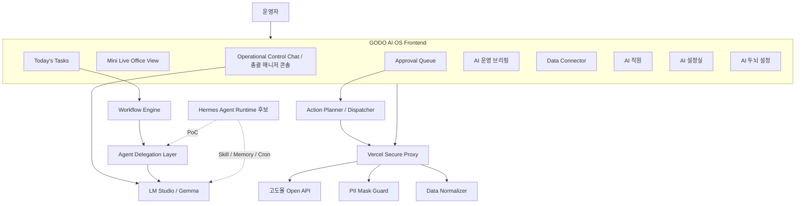

# GODO AI OS Project State 완전판

> 최종 업데이트: 2026-06-22  
> 목적: 이 문서는 GODO AI OS 프로젝트의 최신 상태, 제품 철학, 구현 현황, 보안 원칙, 고도몰 Open API 연동 준비, Hermes Agent 도입 검토, 향후 로드맵을 한 문서로 인수인계하기 위한 마스터 컨텍스트입니다.  
> 사용 대상: 새 ChatGPT 세션, Antigravity 에이전트, 신규 개발자, 프로젝트 재개 시점의 태준님.

---

## 0. 가장 중요한 현재 결론

GODO AI OS는 **고도몰 내부를 직접 커스터마이징하는 프로젝트가 아닙니다.**

고도몰 기본 솔루션은 그대로 사용하고, 그 바깥에 **웹 기반 AI 운영 서포팅 시스템**을 붙여 쇼핑몰 운영의 편의성과 속도를 높이는 구조입니다.

```text
고도몰 기본 솔루션
→ Open API로 주문/상품/재고/문의/리뷰 데이터 조회
→ GODO AI OS에서 정리, 분석, 요약, 초안 생성, 승인 큐 구성
→ 운영자가 최종 확인
→ 필요한 경우 승인 후 제한적으로 고도몰 API에 반영
```

현재 프로젝트는 단순 목업을 넘어 아래 단계까지 진행되었습니다.

```text
완료:
- 운영자 중심 Today’s Operation UI
- 중앙 Operational Control Chat 총괄 매니저 콘솔
- Approval Queue
- AI 직원 체계
- Data Connector
- Secure Proxy Mock
- LM Studio / Gemma 로컬 LLM Bridge
- CS 답변 초안 생성 및 Approval Queue 연결
- Operational Control Chat 권한 모델 v2
- 고도몰 basic 테스트몰 생성
- 기본 샘플 상품 12개 확인
- 고도몰 Open API 개발자 등록 신청 완료

대기/다음:
- 고도몰 개발자 등록 승인
- 제휴사키 / 사용자키 확보
- 고도몰 Open API READ Bridge 구현
- 상품조회 API PoC
- 주문조회 / 게시판 조회 확장
- Hermes Agent 후면 런타임 PoC
```

---

## 1. 프로젝트 개요

| 항목 | 내용 |
|---|---|
| 프로젝트명 | GODO AI OS |
| 목적 | NHN 고도몰 기반 쇼핑몰 운영을 다중 AI 에이전트와 운영자 승인 흐름으로 보조하는 웹 기반 AI 운영센터 |
| 핵심 사용자 | 쇼핑몰 운영자, 디자인/운영 담당자, CS/마케팅/상품 관리 담당자 |
| 핵심 철학 | AI는 수집, 분석, 요약, 초안, 제안을 담당하고 사람은 최종 검토, 승인, 실행 명령을 담당한다 |
| 현재 상태 | 운영자 UX와 로컬 LLM Bridge가 구현된 샌드박스 MVP. 고도몰 Open API 승인 대기 중 |
| 테스트몰 | `https://locostar76.godomall.com/` |
| 로컬 LLM | LM Studio + `google/gemma-4-e4b` |
| 배포 | Vercel 배포 완료. 최신 Production/Preview 커밋은 작업 전 반드시 확인 필요 |

---

## 2. 제품 철학

### 2.1 GODO AI OS의 정체성

GODO AI OS는 “AI가 쇼핑몰을 마음대로 운영하는 시스템”이 아닙니다.

정확한 정체성은 다음과 같습니다.

```text
운영자를 위한 AI 운영 보조 OS
AI 직원들이 각 파트의 반복 업무를 수행
총괄 매니저 콘솔이 이를 조율
운영자가 최종 승인 및 실행 지시
모든 민감 작업은 추적 가능한 기록으로 남김
```

### 2.2 Human-in-the-loop 원칙

다음 작업은 AI가 직접 실행하면 안 됩니다.

```text
- 실제 고객 답변 등록
- 쿠폰 발급
- 가격 변경
- 상품 정보 수정
- 환불 처리
- 주문 상태 변경
- 문자/메일 발송
- 재고 수량 변경
```

다만 “무조건 불가”가 아니라, 다음 흐름을 거쳐야 합니다.

```text
운영자 명령
→ 대상 확인
→ 필수 조건 확인
→ 부족 조건 질문
→ 실행 가능 여부 판단
→ 운영자 최종 확인
→ Secure Proxy를 통한 실행
→ Audit Log 기록
```

### 2.3 Local First Hybrid AI

일상적이고 반복적인 작업은 로컬 모델을 우선 사용합니다.

```text
로컬 Gemma / LM Studio:
- CS 문의 분류
- 짧은 답변 초안
- 주문/재고 요약
- 운영 브리핑
- 단순 운영 질의응답

Cloud AI 후보:
- 시장 조사
- 경쟁사 분석
- 장문 마케팅 전략
- 고난도 카피라이팅
- 외부 트렌드 수집 후 분석
```

Cloud AI는 현재 구현 범위가 아니며, 향후 Secure Proxy와 PII 마스킹 이후 제한적으로 도입합니다.

### 2.4 보안 원칙

```text
- API Key는 프론트엔드에 절대 저장하지 않는다.
- localStorage, sessionStorage, indexedDB에 인증키 저장 금지.
- 고객 이름, 전화번호, 이메일, 주소 등 PII는 LLM 전달 전 마스킹한다.
- 클라우드 LLM에는 원본 고객정보를 보내지 않는다.
- 고도몰 write action은 반드시 승인 큐와 Secure Proxy를 통한다.
- 모든 실행성 작업은 작업 기록/Audit Log에 남긴다.
```

---

## 3. 전체 시스템 아키텍처



---

## 4. 현재 UI 구조

### 4.1 Today’s Operation 최신 레이아웃

기존에는 중앙에 큰 Live Office View가 있었고, 좌측에 작은 채팅창이 있었습니다.

현재는 역할이 교체되었습니다.

```text
좌측:
- Mini Live Office View
- AI 운영 브리핑 요약

중앙:
- Operational Control Chat 대형 콘솔
- Quick Task Add
- 추천 명령
- 입력창

우측:
- Today’s Tasks
- Approval Queue
```

### 4.2 변경 이유

초기에는 Live Office View가 메인 시각 장치였지만, 지금은 Operational Control Chat이 실제 운영 명령 콘솔이 되었습니다.

따라서 화면의 중심은 Live Office View가 아니라 총괄 매니저 콘솔이어야 합니다.

### 4.3 운영 브리핑 상태 수정

운영 브리핑은 단순히 `isOperating` 여부만 보면 안 됩니다.

필요한 상태 구조:

```ts
type OperationRunState = 'idle' | 'running' | 'completed';
```

규칙:

```text
idle:
- 아직 오늘의 운영이 시작되지 않았습니다.

running:
- 현재 AI 운영팀이 주문, 문의, 리뷰, 재고, 매출을 확인하고 있습니다.
- 실시간 감지 항목 표시

completed:
- 오늘의 운영 점검이 완료되었습니다.
- 마지막 브리핑 요약 유지
- 절대 “아직 시작되지 않았습니다”로 되돌아가지 않음
```

---

## 5. Operational Control Chat 권한 모델 v2

Operational Control Chat은 단순 챗봇이 아닙니다.

현재 역할:

```text
- 운영자의 직속 비서 콘솔
- 운영 명령 접수창
- AI 에이전트 호출 창구
- Approval Queue 승인/거절 명령창
- 민감 작업 조건 수집 창구
- 일상 질문 응답 창구
```

### 5.1 4단계 권한 모델

#### LEVEL 1. 조회 / 설명

즉시 처리합니다. 가능하면 Gemma를 호출하지 않고 local state로 답합니다.

예:

```text
오늘 승인할 일 있어?
미답변 문의 뭐야?
오늘 주문 몇 건이야?
재고 위험 상품 알려줘.
```

#### LEVEL 2. 안전한 내부 작업 실행

외부 시스템을 변경하지 않는 내부 작업은 즉시 실행 가능합니다.

예:

```text
오늘의 운영 시작해줘.
CS 상담 AI에게 미답변 문의 분석시켜.
재고 AI에게 위험 상품 확인시켜.
리뷰 AI에게 답글 초안 만들어보라고 해.
```

#### LEVEL 3. 승인 기반 실행

Approval Queue에 올라온 항목은 채팅으로 승인/거절할 수 있습니다.

예:

```text
다 확인했으니 전부 승인해.
리뷰 답글 승인해.
CS 답변 초안 2번 반려해.
```

명확하면 즉시 처리, 애매하면 어떤 항목인지 질문합니다.

#### LEVEL 4. 민감 외부 액션

쿠폰, 가격, 환불, 고객 답변, 상품 수정 등은 조건을 수집하고 실행 가능 여부를 판단합니다.

예:

```text
리페어 크림 구매 고객에게 20% 쿠폰 발급해.
상품 가격 20% 내려.
고객 문의 1번 답변 등록해.
```

고도몰 API가 미연동인 현재는 실행하지 않고 “실행 대기 이력”으로 기록합니다.

### 5.2 총괄 매니저 AI와 전문 에이전트의 관계

총괄 매니저 AI는 전문 에이전트를 흉내 내지 않습니다.

잘못된 구조:

```text
총괄 매니저가 “제가 마케팅 AI로서...”라고 답변
실제 에이전트 호출 없이 “마케팅 AI 의견입니다”라고 꾸며냄
```

올바른 구조:

```text
운영자 요청
→ 총괄 매니저가 담당 에이전트 식별
→ 에이전트 작업 또는 결과 조회
→ 총괄 매니저가 결과 요약 전달
→ 필요 시 Today’s Tasks / Approval Queue 연결
```

---

## 6. AI 에이전트 구성

GODO AI OS에는 9명의 AI 에이전트가 있습니다.

| 에이전트 | 역할 |
|---|---|
| 총괄 매니저 AI | 전체 운영 조율, 명령 접수, 에이전트 호출, 승인 흐름 관리 |
| CS 상담 AI | 문의 분류, 정책 검색, 답변 초안 작성 |
| 주문 확인 AI | 신규 주문 확인, 입금/결제/송장 이상 감지 |
| 배송 추적 AI | 배송 지연, 송장 누락, 배송 상태 이상 감지 |
| 리뷰 답글 AI | 리뷰 감성 분석, 답글 초안 생성 |
| 마케팅 기획 AI | 구매 이력 분석, 재구매 캠페인, 프로모션 제안 |
| 상품 관리 AI | 상품 정보 오류, 노출/판매 상태, 수정 초안 제안 |
| 재고 감시 AI | 품절 위험, 안전 재고 미달, 발주 요청 초안 |
| 매출 분석 AI | 매출 요약, 이상징후, 추세 분석 |

각 에이전트는 다음 구성 요소를 가집니다.

```text
- Role
- Stats
- System Prompt
- Knowledge
- Skills
- Tools
- Permissions
- Memory
```

---

## 7. Brain / 지식 구조

Brain은 RAG를 모사한 운영 지식 저장소입니다.

기본 지식 문서 예:

```text
cs_policy.md
배송 정책
delivery_policy.md
refund_exchange_policy.md
product_expression_rules.md
inventory_snapshot.json
order_check_template.md
cs_auto_template.md
daily_operation_report.md
campaign_result_report.md
cs_decision_log.md
marketing_decision_log.md
review_reply_template.md
sales_report_template.md
risk_handling_guide.md
```

향후 실제 운영 전에는 회사 정책, 실제 배송/교환/반품 규정, 실제 CS 말투, 제품군별 주의 문구를 반영해 다시 세팅해야 합니다.

---

## 8. Studio / 설정실

Studio는 AI 직원과 운영 지식, 스킬, 권한을 코드 없이 수정하기 위한 설정실입니다.

구성:

```text
- Brain Editor
- Agent Editor
- Skill Registry
- Tool Registry
- Permission Matrix
- Import / Export
```

저장 방식:

```text
localStorage:
- godo.brainKnowledge
- godo.agents
- godo.skills
- godo.tools
- godo.permissionMatrix
- godo.studio.lastSavedAt
```

중요:

```text
표시 이름 등 가벼운 설정은 채팅에서 변경할 수 있어도,
권한, 도구, API 실행 범위, 스킬 같은 고위험 설정은 관리자 설정실에서 관리해야 한다.
```

---

## 9. Engine / AI 두뇌 설정

Engine은 작업별로 어떤 LLM 엔진을 쓸지 결정하는 라우팅 허브입니다.

현재 핵심 상태:

```text
로컬 LLM 연결 완료
LM Studio endpoint: http://localhost:1234/v1
프론트 fetch proxy: /lmstudio/v1
확인된 모델: google/gemma-4-e4b
embedding 모델: text-embedding-nomic-embed-text-v1.5
```

Engine Modes:

```text
Demo
Local First
Cloud First
Hybrid Auto
Manual Control
```

현재는 Local First 전략이 중심입니다.

---

## 10. LM Studio / Gemma LLM Bridge 완료 상태

기존 문서의 “GODO LLM BRIDGE MVP 미구현” 내용은 오래된 정보입니다.

현재는 1차 LLM Bridge가 구현되어 있습니다.

### 10.1 구현된 기능

```text
- LM Studio /v1/models 조회
- LM Studio /v1/chat/completions 호출
- Vite proxy로 CORS 해결
- CS 답변 초안 생성
- 실패 시 fallback
- Approval Queue에 초안 카드 생성
- 모델 ID / 응답 상태 로그 기록
```

### 10.2 주요 파일

```text
src/services/lmsConnector.ts
src/engine/csDraftGenerator.ts
src/components/EnginePanel.tsx
src/data/defaultEngineData.ts
src/types/engine.ts
src/App.tsx
vite.config.ts
```

### 10.3 CORS 해결

브라우저에서 직접 LM Studio에 접근하면 CORS 오류가 발생했습니다.

해결:

```text
Vite proxy:
/lmstudio/v1 → http://localhost:1234/v1
```

표시 endpoint와 fetch endpoint를 분리했습니다.

```text
화면 표시: http://localhost:1234/v1
실제 fetch: /lmstudio/v1
```

---

## 11. Approval Queue / OperationArtifact 구조

CS 초안과 리뷰/마케팅 제안이 단순 텍스트 로그로 사라지지 않도록 산출물 구조를 보강했습니다.

구현된 개념:

```text
OperationArtifact:
- 작업 결과물
- 원본 데이터 요약
- AI 생성 초안
- 참조 지식
- 모델 정보
- 승인 연결 정보

ApprovalItem:
- 승인 대기 카드
- originalIssue
- maskedInput
- generatedDraft
- metadata
- riskLevel
- approval state
```

모달:

```text
TaskResultModal
ApprovalDetailModal
```

원칙:

```text
운영자 화면에는 쉬운 업무 정보가 먼저 보인다.
기술 정보는 접힘 영역 또는 설정 화면에서만 본다.
```

---

## 12. Data Connector

Data Connector는 CSV/JSON 파일을 정규화하고 PII를 마스킹합니다.

지원 도메인:

```text
orders
inquiries
reviews
inventory
sales
```

표준 데이터 타입 예:

```text
StandardOrder
StandardInquiry
StandardReview
StandardInventoryItem
StandardSalesSummary
```

localStorage:

```text
godo.data.activeSnapshot
godo.data.importHistory
godo.data.lastSavedAt
```

주의:

```text
godo.operationsData, godo.importHistory는 과거 설계상 언급된 deprecated 키로 간주.
현재는 godo.data.* 네임스페이스 기준.
```

---

## 13. API Bridge / Secure Proxy 현재 상태

현재 API Bridge는 실제 고도몰 API가 아닌 Mock / Secure Proxy 구조로 동작합니다.

### 13.1 기존 Secure Proxy 역할

```text
- API Key 프론트 노출 방지
- Vercel Serverless Function 기반 proxy
- PII 마스킹
- mock 데이터 응답
- health check
```

### 13.2 기존 파일

```text
api/godomall/health.ts
api/godomall/sync.ts
api/godomall/orders.ts
api/godomall/inquiries.ts
api/godomall/reviews.ts
api/godomall/inventory.ts
api/godomall/sales.ts
api/_shared/secretGuard.ts
api/_shared/piiMaskGuard.ts
api/_shared/proxyResponse.ts
api/_shared/mockProxyData.ts
```

### 13.3 ESM import 주의

Vercel Serverless Functions에서 상대경로 import 시 `.js` 확장자를 반드시 포함해야 합니다.

예:

```ts
import { sendJson } from '../_shared/proxyResponse.js';
```

---

## 14. 고도몰 테스트몰 상태

실제 고도몰 API 연결을 위해 무료 basic 테스트몰을 생성했습니다.

```text
테스트몰 도메인:
https://locostar76.godomall.com/

상태:
- 관리자 로그인 가능
- 기본 샘플 상품 12개 자동 등록 확인
- 관리자 상품 리스트 확인
- 프론트 상품 노출 확인
```

기본 상품 12개가 있으므로 API 승인 후 상품조회 API는 바로 테스트 가능합니다.

### 14.1 추천 테스트 데이터 보강

기본 상품은 대부분 정상 상태이므로 운영 이슈 테스트에는 약간 부족할 수 있습니다.

승인 대기 중 해두면 좋은 설정:

```text
상품 1개: 재고 2개
상품 1개: 재고 0개 또는 품절
상품 1개: 판매중지
상품 1개: PC 노출 안 함
상품 1개: 모바일 노출 안 함
상품 1개: 옵션 상품으로 설정
```

추가 확인할 것:

```text
상품문의 게시판 구조
상품후기/리뷰 기능
무통장 주문 생성 가능 여부
주문 상태 변경 가능 여부
게시판 ID 또는 게시판 코드 확인 가능 여부
```

---

## 15. 고도몰 Open API 신청 상태

Open API 개발자센터에서 개발자 등록 신청을 완료했습니다.

신청 방향:

```text
개발자 분류: 쇼핑몰 직접 개발
목적: 자사 테스트 쇼핑몰 운영 데이터 조회 및 내부 운영 관리 보조 시스템 개발
초기 연동: 조회 API 중심
쓰기성 기능: 향후 운영자 최종 승인 기반으로 제한적 사용
API 인증키: 서버 환경변수에만 보관, 프론트 노출 금지
```

현재는 고도몰 측 승인 연락을 기다리는 단계입니다.

예상 흐름:

```text
개발자 등록 신청
→ 개발자 승인
→ 제휴사키 partner_key 발급
→ 마이페이지에서 사용자키 신청
→ 쇼핑몰과 사용자키 매칭
→ key 발급
→ API 테스트
```

---

## 16. 고도몰 Open API 문서 분석 요약

업로드된 고도몰5 Open API 문서 기준으로 확인한 사항입니다.

### 16.1 기본 통신 구조

```text
연동 방식: POST
데이터 수신: XML
인코딩: UTF-8
인증: partner_key + key
API 사용 전 승인 필요
sandbox URL: http://sbopenhub.godo.co.kr/
real URL: https://openhub.godo.co.kr/
```

### 16.2 주요 API 범위

```text
상품 API:
- 상품조회
- 상품등록
- 상품수정
- 상품삭제
- 상품재고변경
- 상품 카테고리/브랜드 조회 후보

주문 API:
- 주문조회
- 주문상태변경

게시판 API:
- 게시판 리스트 조회
- 게시물 리스트 조회
- 게시물 등록
- 게시물 수정
- 게시물 삭제
- 게시물 답변 등록
- 게시물 댓글 등록/수정/삭제

기타:
- 공통코드조회
- API Key 유효성 체크
```

### 16.3 GODO AI OS 1차 READ Bridge 우선순위

```text
1. API Key 유효성 체크
2. 상품조회 API
3. 주문조회 API
4. 게시판 리스트 조회 API
5. 게시물 리스트 조회 API
6. 공통코드조회 API
```

### 16.4 2차 승인 기반 WRITE 후보

```text
- 게시물 답변 등록
- 주문상태변경
- 상품재고변경
- 상품수정
- 가격 변경
- 쿠폰 발급은 API 제공 여부 추가 확인 필요
```

---

## 17. 실제 고도몰 API READ Bridge 설계 방향

고도몰 Open API는 POST + XML 기반이므로, 프론트에서 직접 호출하지 않습니다.

권장 구조:

```text
GODO Frontend
→ /api/godomall/products
→ Vercel Secure Proxy
→ 고도몰 Open API POST/XML 요청
→ XML 응답 수신
→ XML 파싱
→ PII 마스킹
→ Standard JSON 변환
→ Frontend 반환
```

### 17.1 환경변수 제안

기존 mock용 env 이름과 실제 Open API 인증 구조가 다를 수 있습니다.

권장:

```text
GODOMALL_PARTNER_KEY=...
GODOMALL_USER_KEY=...
GODOMALL_BASE_URL=https://openhub.godo.co.kr/
GODOMALL_SANDBOX_URL=http://sbopenhub.godo.co.kr/
GODOMALL_API_MODE=sandbox | real
```

기존 코드의 `GODOMALL_API_KEY`, `GODOMALL_API_SECRET`가 있다면 실제 Open API 구조에 맞게 alias 또는 migration이 필요합니다.

### 17.2 XML 파서 필요

Vercel Serverless에서 XML 응답을 파싱해 JSON으로 변환해야 합니다.

후보:

```text
fast-xml-parser
xml2js
```

단, 의존성 추가 전 Vercel 빌드와 TypeScript 호환을 확인해야 합니다.

---

## 18. Hermes Agent 도입 검토

Hermes Agent는 GODO AI OS의 UI 대체재가 아닙니다.

추천 방향:

```text
GODO OS UI는 유지
Hermes는 뒤쪽 에이전트 런타임 후보로 사용
Gemma/LM Studio와 연결 가능성 PoC
GODO Secure Proxy와 Approval Queue 권한 모델 유지
```

### 18.1 기대 역할

```text
- 장기 기억
- 반복 업무 스킬화
- 정기 작업 cron
- 전문 에이전트 위임
- 에이전트 실행 결과 생성
- GODO OS로 AgentDelegationResult 반환
```

### 18.2 하면 안 되는 것

```text
- Slack/Discord/Telegram 중심 UI로 GODO OS 대체
- Hermes가 직접 고도몰 write action 실행
- Hermes memory에 원본 고객 개인정보 저장
- GODO Approval Queue 우회
```

### 18.3 PoC 후보

1차 PoC:

```text
Hermes 설치
→ LM Studio endpoint 연결
→ 한국어 대화
→ GODO 업무 Skill 1개 생성
→ daily_operation_briefing_skill 테스트
```

GODO OS 연결 PoC:

```text
GODO 총괄 매니저 콘솔
→ /api/hermes/delegate
→ Hermes skill 실행
→ 결과 반환
→ Today’s Tasks 또는 Approval Queue 반영
```

---

## 19. 최신 Git / Vercel 상태

기존 문서의 Git/Vercel 상태는 오래되었을 수 있습니다.

확인된 이력:

```text
- Vercel 배포 완료
- checkpoint/llm-bridge-mvp-local-gemma 브랜치 Preview Ready 확인 이력 있음
- Production 반영 여부는 main 병합 또는 Promote 상태에 따라 확인 필요
```

작업 전 반드시 확인:

```bash
git status
git branch
git log --oneline -5
```

Vercel에서 확인할 것:

```text
- 최신 Production commit
- 최신 Preview commit
- 배포 대상 브랜치
- 환경변수 설정 여부
```

---

## 20. 개발 시 반드시 지킬 규칙

### 20.1 검증 루틴

모든 코드 수정 후 반드시 실행합니다.

```bash
npm run lint
npx tsc --noEmit
npm run build
```

### 20.2 API Key 규칙

```text
금지:
- 프론트 코드 하드코딩
- localStorage 저장
- sessionStorage 저장
- indexedDB 저장
- 브라우저 전역 상태 저장
- 로그 출력
- 응답 JSON에 원본 키 포함

허용:
- Vercel 환경변수
- 서버 사이드 Secure Proxy 내부 사용
- health endpoint에서 boolean만 반환
```

### 20.3 개인정보 규칙

```text
- 고객 이름, 전화번호, 이메일, 주소는 마스킹 후 처리
- LLM 프롬프트에는 원본 PII 전달 금지
- Cloud AI에는 마스킹된 데이터만 전달
- 작업 기록에는 마스킹된 값 또는 통계 수치만 저장
```

### 20.4 고도몰 API 규칙

```text
- 프론트에서 고도몰 API 직접 호출 금지
- POST + XML 구조 고려
- rate limit 고려
- READ Bridge부터 구현
- WRITE는 Approval Queue와 Audit Log 이후 구현
```

---

## 21. 최신 우선순위 로드맵

### 1순위. 고도몰 API 승인 대기

```text
- 개발자 등록 승인 확인
- 제휴사키 확인
- 사용자키 신청
- 테스트몰과 키 매칭
```

### 2순위. 고도몰 Open API READ Bridge 구현

```text
- Vercel Secure Proxy에서 POST/XML 요청
- XML 응답 파싱
- Standard JSON 변환
- PII 마스킹
- Data Connector / Today’s Operation에 연결
```

### 3순위. 상품조회 API PoC

테스트몰에 기본 상품 12개가 있으므로 가장 먼저 상품조회 API를 연결합니다.

확인할 필드:

```text
상품코드
상품명
판매가
공급사
노출상태
판매상태
재고
이미지
등록/수정일
카테고리
```

### 4순위. 주문 / 게시판 READ 확장

```text
- 주문조회 API
- 게시판 리스트 조회
- 게시물 리스트 조회
- 상품문의/후기/1:1문의가 어떤 게시판 구조로 내려오는지 확인
- 게시판 ID 매핑 테이블 구성
```

### 5순위. Hermes PoC

```text
- Hermes 설치
- LM Studio Gemma endpoint 연결 가능성 확인
- GODO 업무 Skill 1개 작성
- GODO OS에서 AgentDelegationResult 형태로 결과 수신
```

### 6순위. 승인 기반 Write Action

Read-Only 안정화 후 진행합니다.

후보:

```text
- 게시물 답변 등록
- 주문상태변경
- 상품재고변경
- 상품수정
- 가격 변경
- 쿠폰 발급은 API 제공 여부 확인 후 판단
```

---

## 22. 새 AI 세션 시작용 최신 요약

아래 내용을 새 대화나 Antigravity에 붙여넣으면 됩니다.

```markdown
[GODO AI OS 최신 컨텍스트 요약]

GODO AI OS는 고도몰 기반 쇼핑몰 운영을 보조하는 웹 기반 다중 AI 에이전트 운영센터다. 고도몰 내부를 직접 커스터마이징하는 프로젝트가 아니라, 고도몰 기본 솔루션 위에 붙는 외부 AI 운영 보조 레이어다.

핵심 철학:
- AI는 수집, 분석, 요약, 초안, 제안을 담당한다.
- 사람은 최종 검토, 승인, 실행 명령을 담당한다.
- 개인정보는 반드시 마스킹한다.
- API Key는 프론트에 절대 저장하지 않는다.
- 고도몰 write action은 Approval Queue와 Secure Proxy를 거쳐야 한다.

완료된 주요 작업:
1. Today’s Operation UI
2. 중앙 Operational Control Chat 총괄 매니저 콘솔
3. Mini Live Office View
4. AI 운영 브리핑 완료 상태 유지
5. Today’s Tasks / Approval Queue
6. AI 직원 9명 구조
7. Data Connector 및 PII 마스킹
8. Vercel Secure Proxy Mock
9. LM Studio / Gemma 로컬 LLM Bridge
10. CS 답변 초안 생성 및 Approval Queue 연결
11. Operational Control Chat 권한 모델 v2
12. 고도몰 basic 테스트몰 생성
13. 테스트몰 임시도메인: https://locostar76.godomall.com/
14. 기본 샘플 상품 12개 확인
15. 고도몰 Open API 개발자 등록 신청 완료

확인된 로컬 모델:
- LM Studio endpoint: http://localhost:1234/v1
- 실제 모델: google/gemma-4-e4b
- embedding 모델: text-embedding-nomic-embed-text-v1.5

고도몰 API 확인사항:
- POST + XML 기반
- UTF-8
- partner_key + key 인증
- API 사용 전 승인 필요
- sandbox: http://sbopenhub.godo.co.kr/
- real: https://openhub.godo.co.kr/

다음 우선순위:
1. 고도몰 개발자 등록 승인 대기
2. 제휴사키/사용자키 확보
3. Vercel 환경변수에 키 저장
4. 상품조회 API부터 READ Bridge PoC
5. 주문조회, 게시판 조회로 확장
6. Hermes Agent는 GODO OS의 UI가 아니라 후면 에이전트 런타임 후보로 PoC 검토
7. Write Action은 Read 안정화 후 Approval Queue 기반으로 제한적 도입

주의:
- 총괄 매니저 AI는 전문 에이전트를 흉내 내지 않고 실제 에이전트 결과를 호출/전달한다.
- Hermes가 도입되어도 고도몰 write action은 GODO Secure Proxy와 Approval Queue를 우회하면 안 된다.
- 개발 전 git status, git branch, git log --oneline -5, Vercel 최신 배포 커밋을 확인한다.
```

---

## 23. Antigravity 다음 작업 프롬프트: 고도몰 READ Bridge PoC

고도몰 API 키가 발급된 뒤 Antigravity에 전달할 작업 프롬프트입니다.

```markdown
GODO AI OS 프로젝트의 최신 PROJECT_STATE_COMPLETE 문서를 확인했습니다.
현재 목표는 고도몰 Open API READ Bridge 1차 PoC입니다.

중요 원칙:
- 프론트에서 고도몰 API를 직접 호출하지 않습니다.
- partner_key와 key는 Vercel 환경변수에만 저장합니다.
- API Key는 화면, 로그, 응답 JSON에 절대 노출하지 않습니다.
- 고도몰 API는 POST + XML 기반이므로 서버리스 프록시에서 XML 요청/응답을 처리합니다.
- 이번 작업은 READ ONLY입니다. 상품수정, 답변등록, 주문상태변경 등 write action은 구현하지 않습니다.

1차 목표:
1. 환경변수 구조를 정리합니다.
   - GODOMALL_PARTNER_KEY
   - GODOMALL_USER_KEY
   - GODOMALL_BASE_URL
   - GODOMALL_API_MODE
2. /api/godomall/health에서 키 존재 여부만 boolean으로 표시합니다.
3. 고도몰 API Key 유효성 체크 엔드포인트를 구현합니다.
4. 상품조회 API PoC를 구현합니다.
5. XML 응답을 파싱해 StandardProduct 또는 StandardInventoryItem 형태로 변환합니다.
6. 테스트몰 기본 상품 12개가 GODO AI OS에 표시되는지 확인합니다.
7. Data Connector 또는 API Bridge Panel에서 실제 API Source로 표시합니다.
8. Today’s Operation의 상품/재고 관련 카드에 실제 상품 수치를 반영합니다.
9. 실패 시 운영자에게 쉬운 오류 문구를 표시하고, 개발자 상세 정보는 접힘 영역에만 표시합니다.
10. 완료 후 npm run lint, npx tsc --noEmit, npm run build를 모두 통과시킵니다.
```

---

## 24. 문서 관리 규칙

이 문서는 앞으로 프로젝트가 크게 변경될 때마다 업데이트해야 합니다.

업데이트가 필요한 순간:

```text
- 고도몰 API 키 발급 완료
- 상품조회 API 연결 완료
- 주문조회 API 연결 완료
- 게시판 조회 API 연결 완료
- Hermes PoC 완료
- Write Action 최초 구현
- Production 배포 변경
- 에이전트 구조 대폭 변경
- 보안 정책 변경
```

문서 업데이트 시 반드시 “오래된 예정 작업”을 완료 상태로 바꾸고, 최신 우선순위를 다시 정리합니다.

