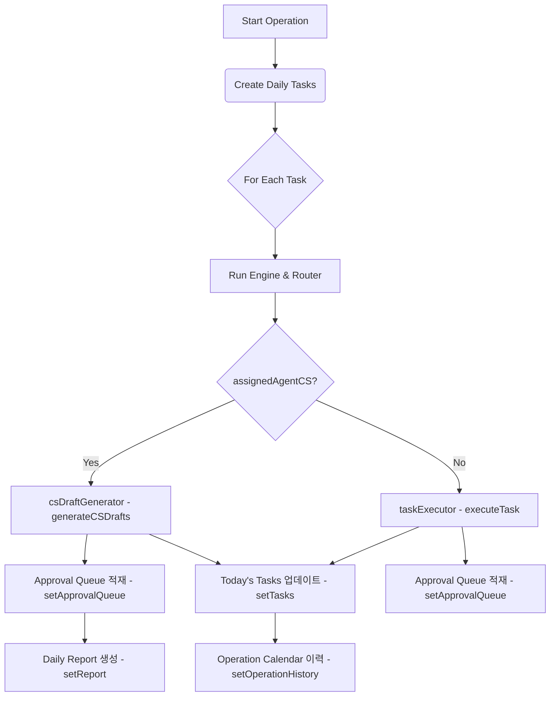

# GODO AI OS 데이터 흐름 및 스키마 분석 보고서

본 문서는 **Today’s Tasks**와 **Approval Queue**에서 AI 산출물의 상세 본문을 조회할 수 있도록 개선하기 전, GODO AI OS의 현재 데이터 흐름, 표준 스키마, 상태 관리 방식 및 컴포넌트 구조를 상세히 분석한 결과입니다.

---

## 1. Data Connector 표준화 도메인별 스키마

Data Connector는 외부 원본 데이터(CSV, API 등)를 가져와 `dataNormalizer.ts`를 거쳐 일관된 영어 키와 정규화된 형태를 갖춘 스키마로 표준화합니다. 

### 1) 도메인별 표준 인터페이스 및 주요 필드 (`src/types/dataConnector.ts`)

| 도메인 | 인터페이스 명 | 주요 필드 구성 및 특징 |
| :--- | :--- | :--- |
| **orders** | `StandardOrder` | `id`, `orderNo`, `orderDate` (YYYY-MM-DD), `customerNameMasked` (마스킹 적용), `productName`, `optionName`, `quantity`, `paymentStatus`, `deliveryStatus`, `invoiceNo`, `amount`, `riskFlags` (위험 요소 배열) |
| **inquiries** | `StandardInquiry` | `id`, `inquiryDate` (YYYY-MM-DD), `category`, `customerNameMasked`, `title`, `content` (PII 차단 필터링 적용), `status`, `priority`, `sentiment` (`'positive'` \| `'neutral'` \| `'negative'`), `riskFlags` |
| **reviews** | `StandardReview` | `id`, `reviewDate` (YYYY-MM-DD), `productName`, `rating` (1~5), `content` (마스킹 적용), `sentiment` (`'positive'` \| `'neutral'` \| `'negative'`), `needsReply` (평점 3점 이하일 때 true), `riskFlags` |
| **inventory** | `StandardInventoryItem` | `id`, `productName`, `optionName`, `stock`, `safetyStock`, `status` (`'ok'` \| `'warning'` \| `'danger'`), `riskFlags` |
| **sales** | `StandardSalesSummary` | `date` (YYYY-MM-DD), `totalSales`, `orderCount`, `conversionRate`, `topProducts` (문자열 배열), `memo` (선택 사항) |

### 2) `dataNormalizer.ts`에서의 매핑 구조
- **컬럼 헤더 한영 매핑**: `columnMapping` 사전을 정의하여 한국어 열 이름을 표준 영문 키로 1:1 전환합니다. (예: `주문번호` $\rightarrow$ `orderNo`, `문의일자` $\rightarrow$ `inquiryDate`, `평점` $\rightarrow$ `rating`, `재고` $\rightarrow$ `stock` 등)
- **PII(개인식별정보) 자동 마스킹**: `privacyMask.ts`의 유틸리티를 활용하여 `customerNameMasked` 처리를 하고, `content` 본문 내의 이메일 및 전화번호는 정규표현식을 통해 `[전화번호 마스킹]`, `[이메일 마스킹]` 등으로 교체합니다.
- **감정 분석 및 비즈니스 위험 산출**:
  - `inquiries`/`reviews`: 텍스트 내 키워드('불만', '환불', '최악' 등) 및 평점을 분석하여 감정 태그(`sentiment`)를 지정하고, 답변 필요성(`needsReply`), 긴급성(`urgent`), 결제지연, 송장누락 등을 감지하여 `riskFlags` 배열에 동적으로 추가합니다.

---

## 2. START OPERATION 실행 후 결과 저장 위치 및 상태 관리

시뮬레이션(`handleStartSimulation`)이 구동되면 각 결과물은 **React State(메모리)** 및 **localStorage**를 활용하여 다음과 같이 관리 및 누적됩니다.



### 1) 데이터 타입 및 상태 관리 요약
* **Today’s Tasks 카드 정보**:
  - **상태 변수**: `tasks` (타입: `OperationTask[]`)
  - **구성 필드**: `status` ('pending' | 'assigned' | 'running' | 'completed' | 'needs_approval' | 'failed'), `resultSummary`, `logs` (작업 내부 로그 배열) 등으로 관리됩니다.
* **생성 산출물 본문 (CS 답변 초안 등)**:
  - **현재 구조**: 생성된 개별 `CSDraftResult` 객체(초안 본문, 추론 지연시간, PII 제거 여부 등 포함)는 **독립적인 영구 State에 객체 형태로 관리되지 않습니다.**
  - **흐름**: 대신 `generateCSDrafts`가 반환한 `draftReply`를 즉시 `proposedText`라는 포맷팅된 문자열로 결합하여 `ApprovalItem`의 `proposedAction` 필드에 기입하고 폐기됩니다.
* **Approval Queue item**:
  - **상태 변수**: `approvalQueue` (타입: `ApprovalItem[]`)
  - **구조**: `proposedAction` 필드에 AI의 제안 내용이 포맷팅된 문자열로 통째로 담깁니다.
* **Activity Log**:
  - **상태 변수**: `logs` (타입: `LogEntry[]`)
  - **구조**: UI 좌하단 실시간 로그 콘솔에 노출되는 문자열 로그 정보입니다.
* **Usage Log (엔진 사용 이력)**:
  - **상태 변수**: `engineUsageLogs` (타입: `EngineUsageLog[]`)
  - **구조**: LLM 호출 결과, 토큰 소요 시간, Fallback 모드 작동 사유 등을 상세히 기록합니다.

---

## 3. Approval Queue Item 타입 확장 제안

### 현 상태
현재 `ApprovalItem` 인터페이스는 아래와 같으며, 원본 텍스트 및 분리된 메타데이터(모델 ID, Latency 등)를 별도로 필터링하여 담을 수 있는 필드가 **존재하지 않습니다.**
```typescript
export interface ApprovalItem {
  id: string;
  taskId: string;
  title: string;
  requestedByAgentId: string;
  riskLevel: TaskRiskLevel;
  reason: string;
  proposedAction: string; // 마크업이 결합된 문자열
  status: 'waiting' | 'approved' | 'rejected';
}
```

### 제안: 인터페이스 확장 (`src/types/approval.ts`)
기존 UI 카드에서 `proposedAction`을 보여주는 구조를 깨뜨리지 않으면서, 새로운 상세 보기 모달에서 구조화된 데이터를 보여주기 위해 다음과 같이 타입을 확장하는 것을 권장합니다.

```typescript
export interface ApprovalItem {
  id: string;
  taskId: string;
  title: string;
  requestedByAgentId: string;
  riskLevel: TaskRiskLevel;
  reason: string;
  proposedAction: string;
  status: 'waiting' | 'approved' | 'rejected';

  // AI 상세 본문 조회를 위한 확장 필드
  originalIssue?: string;   // 원본 고객 문의 내용 또는 처리 대상 로그 원문
  maskedInput?: string;     // PII 마스킹 필터링이 적용된 안전 입력값
  generatedDraft?: string;  // 마스킹/포맷팅 되지 않은 순수 AI 답변 초안 또는 결과 코드
  metadata?: {
    modelId?: string;       // 답변 생성에 활성화된 LLM 엔진 모델명
    latency?: number;       // API 추론 지연 시간 (ms)
    fallbackUsed?: boolean; // 로컬 LLM 오프라인 등으로 템플릿 대체(Fallback) 처리 여부
    piiRemoved?: boolean;   // 개인 정보 자동 제거/마스킹 검출 여부
  };
}
```

---

## 4. Today’s Tasks 카드 컴포넌트 구조 검토

* **대상 파일**: `src/components/TaskBoard.tsx` (L60 ~ L128)
* **현황**: `.task-item` 요소를 리스트 형태로 순회 렌더링하고 있으며, 클릭 이벤트 리스너가 걸려있지 않습니다.
* **연동 용이성**: **매우 쉬움**. 
  - `TaskBoardProps` 인터페이스에 `onSelectTask?: (task: OperationTask) => void` 속성을 추가합니다.
  - 리스트를 렌더링하는 아래 마크업에 `onClick` 핸들러를 얹어주기만 하면 즉시 구현할 수 있습니다.
  ```tsx
  <div 
    key={task.id} 
    className={`task-item ${task.status}`}
    onClick={() => onSelectTask?.(task)}
    style={{ cursor: 'pointer' }}
  >
  ```

---

## 5. Approval Queue 카드 컴포넌트 구조 검토

* **대상 파일**: `src/components/TaskBoard.tsx` (L172 ~ L212)
* **현황**: `.approval-item-card` 엘리먼트 내부에 "승인(Approve)", "거절(Reject)" 버튼이 직결되어 있습니다.
* **연동 용이성**: **매우 쉬움**.
  - 카드의 상세 조회를 위해 `TaskBoardProps` 인터페이스에 `onSelectApproval?: (item: ApprovalItem) => void` 를 추가합니다.
  - 승인/거절 액션 버튼 옆에 **"상세 보기"** 버튼을 배치하거나, 카드 헤더/본문 영역 자체에 클릭 이벤트를 추가하여 모달(`ApprovalDetailModal`)을 안전하게 트리거할 수 있는 구조입니다.
  ```tsx
  {/* 예시: 승인 카드 내부 액션 버튼 라인 확장 */}
  <button 
    className="appr-btn detail" 
    onClick={() => onSelectApproval?.(item)}
  >
    상세 보기
  </button>
  ```

---

## 6. Data Connector 실제 데이터 저장 구조 예시

### 1) orders CSV 정규화 후 `activeOperationsData` 적재 JSON 예시
쇼핑몰 관리자가 orders CSV를 업로드하고 Data Connector가 정규화를 완료했을 때, 내부 React State인 `activeOperationsData`에 저장되는 단일 스냅샷 예시입니다.

```json
{
  "id": "snapshot-csv-1718290000000",
  "sourceType": "csv",
  "importedAt": "2026-06-19T04:26:43.000Z",
  "orders": [
    {
      "id": "order-1718290000000-0",
      "orderNo": "GD-20260619-0001",
      "orderDate": "2026-06-19",
      "customerNameMasked": "김*정",
      "productName": "천연 코코넛 보습 크림 (200ml)",
      "optionName": "기본옵션",
      "quantity": 2,
      "paymentStatus": "결제완료",
      "deliveryStatus": "배송대기",
      "invoiceNo": "",
      "amount": 64000,
      "riskFlags": []
    },
    {
      "id": "order-1718290000000-1",
      "orderNo": "GD-20260615-0010",
      "orderDate": "2026-06-15",
      "customerNameMasked": "박*호",
      "productName": "센서티브 힐링 마사지 오일 (100ml)",
      "optionName": "라벤더향",
      "quantity": 5,
      "paymentStatus": "결제완료",
      "deliveryStatus": "배송중",
      "invoiceNo": "",
      "amount": 124500,
      "riskFlags": ["invoice_missing", "delivery_delayed"]
    }
  ],
  "inquiries": [],
  "reviews": [],
  "inventory": [],
  "sales": [],
  "qualityReport": {
    "totalRows": 2,
    "validRows": 2,
    "warningRows": 2,
    "errorRows": 0,
    "missingRequiredFields": [],
    "duplicateRows": 0,
    "privacyMaskedCount": 2,
    "riskFlagCount": 2,
    "qualityScore": 90,
    "notes": [
      "2건의 이름/연락처 개인 식별정보(PII)가 자동으로 안전 마스킹 필터링되었습니다.",
      "[Row 2] 배송 중인 주문에 송장번호가 누락되었습니다.",
      "[Row 2] 영업일 기준 3일 이상 배송이 지연되고 있습니다."
    ]
  }
}
```

### 2) inquiries/reviews 가 포함된 `API_PROXY_MOCK` 스냅샷 구조 예시
외부 API Bridge가 연동되어 주기적인 동기화를 통해 CS 문의와 리뷰를 땡겨올 때 적재되는 JSON 스냅샷입니다.

```json
{
  "id": "snapshot-api-proxy-mock-latest",
  "sourceType": "api_proxy_mock",
  "importedAt": "2026-06-19T04:30:00.000Z",
  "orders": [],
  "inquiries": [
    {
      "id": "inq-mock-1001",
      "inquiryDate": "2026-06-19",
      "category": "교환/반품",
      "customerNameMasked": "최*영",
      "title": "용기 파손 및 오일 누액건으로 환불 신청합니다.",
      "content": "배송을 받았는데 오일이 새서 박스가 다 젖었네요. [전화번호 마스킹] 으로 연락부탁드려요. 빠른 환불 원합니다.",
      "status": "미답변",
      "priority": "high",
      "sentiment": "negative",
      "riskFlags": ["unanswered", "complaint", "refund_request", "urgent"]
    }
  ],
  "reviews": [
    {
      "id": "rev-mock-2001",
      "reviewDate": "2026-06-19",
      "productName": "아로마 캔들 스페셜 에디션",
      "rating": 1,
      "content": "캔들이 깨져서 조각이 흩어져 왔어요. 다칠 뻔했습니다. 포장이 너무 부실합니다.",
      "sentiment": "negative",
      "needsReply": true,
      "riskFlags": ["low_rating", "negative_review", "needs_reply"]
    }
  ],
  "inventory": [],
  "sales": [],
  "qualityReport": {
    "totalRows": 2,
    "validRows": 2,
    "warningRows": 2,
    "errorRows": 0,
    "missingRequiredFields": [],
    "duplicateRows": 0,
    "privacyMaskedCount": 1,
    "riskFlagCount": 7,
    "qualityScore": 95,
    "notes": [
      "1건의 이름/연락처 개인 식별정보(PII)가 자동으로 안전 마스킹 필터링되었습니다.",
      "[Row 1] 답변이 등록되지 않은 CS 문의가 있습니다.",
      "[Row 1] 환불/취소 요청 CS 문의가 접수되었습니다.",
      "[Row 2] 평점 2점 이하의 저평점 부정 리뷰가 등록되었습니다."
    ]
  }
}
```
